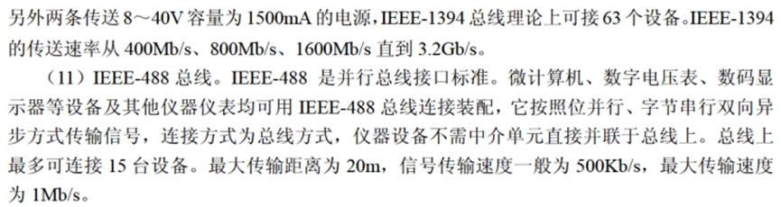
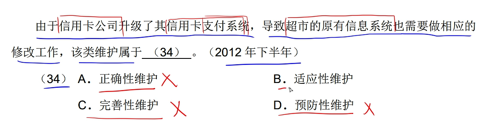
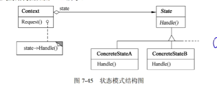
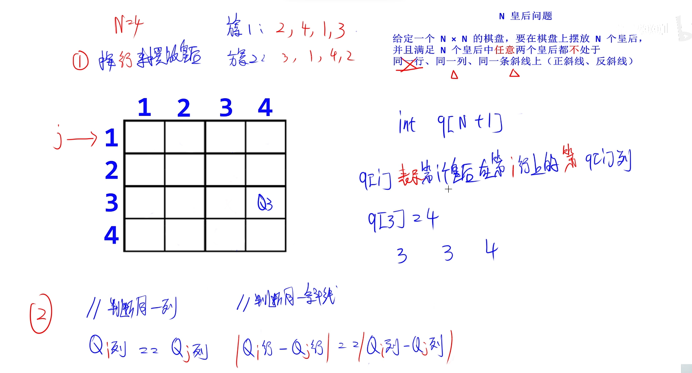
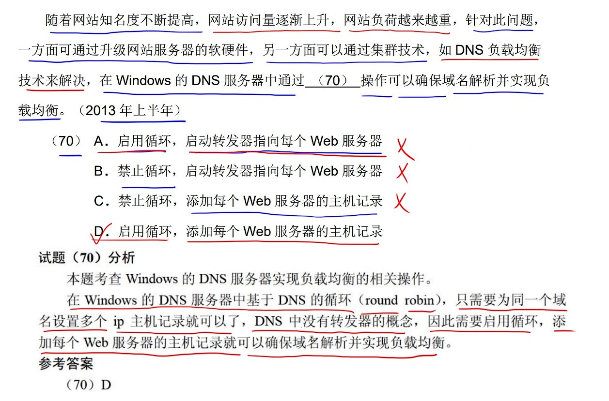
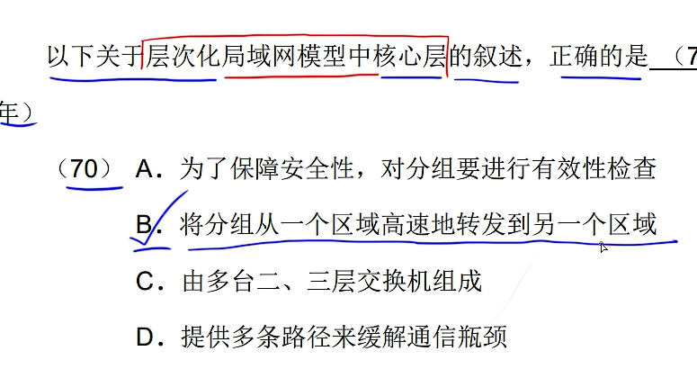

<!-- vscode-markdown-toc -->
* 1. [第一章 计算机系统知识（5~6分）](#56)
	* 1.1. [1.1 计算机系统基础知识](#)
		* 1.1.1. [1.1.1 中央处理单元](#-1)
		* 1.1.2. [1.1.3 数据表示](#-1)
		* 1.1.3. [1.1.4 校验码](#-1)
	* 1.2. [1.2 计算机体系结构](#-1)
		* 1.2.1. [1.2.1 计算机体系结构的发展](#-1)
		* 1.2.2. [1.2.2 存储器](#-1)
		* 1.2.3. [1.2.3 总线（了解）](#-1)
	* 1.3. [1.3 全性、可靠性与系统性能评测基础知识](#-1)
		* 1.3.1. [1.3.2 加密技术和认证技术](#-1)
		* 1.3.2. [加密算法](#-1)
		* 1.3.3. [1.3.3 计算机可靠性](#-1)
* 2. [第二章 程序设计语言基础知识（3~6分）](#36)
	* 2.1. [2.1 程序设计语言概述](#-1)
		* 2.1.1. [2.1.1 程序设计语言的基本概念](#-1)
		* 2.1.2. [2.1.2 程序设计语言的基本成分](#-1)
		* 2.1.3. [2.2.2 编译程序基本原理](#-1)
* 3. [第三章 数据结构](#-13)
		* 3.1. [2.1 顺序表](#-1)
		* 3.2. [2.2 栈](#-1)
		* 3.3. [3.3 树](#-1)
		* 3.4. [4.4 二叉树遍历](#-1)
		* 3.5. [4.5 平衡二叉树](#-1)
		* 3.6. [4.7 哈夫曼编码（贪心）](#-1)
		* 3.7. [5.1 连通图](#-1)
		* 3.8. [6.1  查找](#-1)
		* 3.9. [6.2 哈希表](#-1)
* 4. [第三章 知识产权](#-14)
		* 4.1. [3.1 著作权](#-1)
		* 4.2. [3.2 商标权](#-1)
* 5. [第四章 操作系统知识](#-15)
	* 5.1. [4.1 计算机系统层次图](#-1)
	* 5.2. [4.2 进程管理](#-1)
	* 5.3. [死锁](#-1)
	* 5.4. [磁盘调度](#-1)
* 6. [第五章 软件工程基础知识](#-16)
		* 6.1. [软件过程](#-1)
	* 6.1. [软件过程模型](#-1)
		* 6.1.1. [瀑布模型（有 V 选 瀑 ）](#V)
		* 6.1.2. [增量模型](#-1)
		* 6.1.3. [演化模型](#-1)
		* 6.1.4. [喷泉模型](#-1)
	* 6.2. [敏敏方法](#-1)
		* 6.2.1. [极限编程（XP）](#XP)
		* 6.2.2. [水晶法（Crystal）](#Crystal)
		* 6.2.3. [并列争求法（Scrum）](#Scrum)
		* 6.2.4. [自适应软件开发（ASD）](#ASD)
		* 6.2.5. [敏捷统一过程（AUP）](#AUP)
		* 6.2.6. [需求分析](#-1)
	* 6.3. [概要设计](#-1)
	* 6.4. [详细设计](#-1)
	* 6.5. [系统测试](#-1)
		* 6.5.1. [系统测试原则](#-1)
	* 6.6. [单元测试](#-1)
	* 6.7. [集成测试](#-1)
	* 6.8. [动态测试](#-1)
		* 6.8.1. [黑盒测试](#-1)
		* 6.8.2. [白盒测试](#-1)
		* 6.8.3. [系统维护概述](#-1)
		* 6.8.4. [软件配置管理](#-1)
	* 6.9. [软件质量模型](#-1)
		* 6.9.1. [杂题](#-1)
* 7. [第六章 结构化开发方法](#-17)
	* 7.1. [模块独立](#-1)
		* 7.1.1. [🔺耦合](#-1)
		* 7.1.2. [🔺内聚](#-1)
	* 7.2. [🔺系统结构设计原则](#-1)
	* 7.3. [数据流图](#-1)
	* 7.4. [数据字典](#-1)
		* 7.4.1. [数据字典的内容](#-1)
		* 7.4.2. [加工逻辑的描述](#-1)
* 8. [第七章 面向对象技术](#-18)
		* 8.1. [对象](#-1)
		* 8.2. [封装](#-1)
		* 8.3. [多 态](#-1)
		* 8.4. [面向对象设计的原则](#-1)
* 9. [第七章 UML 类图](#-19)
		* 9.1. [7.1 事物](#-1)
		* 9.2. [7.2 关系](#-1)
		* 9.3. [7.3 UML 中的图](#UML-1)
		* 9.4. [7.4 UML图汇总](#UML-1)
* 10. [第七章🔺设计模式](#-110)
		* 10.1. [7.6 结构型设计模式（7种）](#-1)
		* 10.2. [7.7 行为设计模式（11种）](#-1)
* 11. [第八章 算法设计与分析](#-111)
		* 11.1. [时间复杂度](#-1)
		* 11.2. [空间复杂度](#-1)
		* 11.3. [回溯法](#-1)
		* 11.4. [分治法](#-1)
		* 11.5. [动态规划法](#-1)
		* 11.6. [贪心法](#-1)
* 12. [第九章 数据库技术基础](#-112)
	* 12.1. [9.1 数据库的三级模式结构](#-1)
	* 12.2. [9.2 规范化](#-1)
		* 12.2.1. [1NF（第一范式）](#NF)
		* 12.2.2. [2NF（第二范式）](#NF-1)
		* 12.2.3. [3NF（第三范式）](#NF-1)
		* 12.2.4. [BCNF](#BCNF)
		* 12.2.5. [9.2 数据库设计](#-1)
	* 12.3. [9.3 分布式数据库](#-1)
* 13. [第十章 网络与信息安全基础知识](#-113)
	* 13.1. [网络的设备](#-1)
	* 13.2. [协议簇](#-1)
		* 13.2.1. [传输层协议](#-1)
	* 13.3. [Internet 地址](#Internet)
		* 13.3.1. [电子邮件服务（C/S 模式）](#CS)
		* 13.3.2. [防火墙技术](#-1)
		* 13.3.3. [病毒：](#-1)
		* 13.3.4. [网络安全](#-1)
		* 13.3.5. [杂题：](#-1)
* 14. [第十二章 软件系统分析与设计](#-114)
	* 14.1. [数据库设计的步骤](#-1)
		* 14.1.1. [需求分析](#-1)
		* 14.1.2. [概念结构设计](#-1)
		* 14.1.3. [逻辑结构设计](#-1)
	* 14.2. [试题一（15分）](#15)
	* 14.3. [试题二（15分）](#15-1)
		* 14.3.1. [实体](#-1)
		* 14.3.2. [联系](#-1)
		* 14.3.3. [属性](#-1)
		* 14.3.4. [实体-联系方法](#-)
	* 14.4. [试题三（15分)](#15-2)
	* 14.5. [试题六](#-1)

<!-- vscode-markdown-toc-config
	numbering=true
	autoSave=true
	/vscode-markdown-toc-config -->
<!-- /vscode-markdown-toc -->
>title: 软考-软件设计师 笔记
>author: 顾梦
>about: https://jishuqin.cn/
>description: 该笔记是我跟着b站up主 zst  学习软考记录的，视频链接：[软件设计师学习路线](https://www.bilibili.com/read/cv18526892?spm_id_from=333.999.list.card_opus.click)
>
>下午题，先做1、2、3、6，再做 4
---


# 软件设计师（上午题）

##  1. <a name='56' id='56'></a>第一章 计算机系统知识（5~6分）
###  1.1. <a name=''></a>1.1 计算机系统基础知识
####  1.1.1. <a name='-1'></a>1.1.1 中央处理单元

**中央处理单元（CPU)是计算机系统的核心部件，它负责获取程序指令、对指令进行译码并加以执行。**

##### 1. CPU的功能

例：计算机执行指令的过程中，需要由**A** 产生每条指令的操作信号并将信号送往相应的部件进行处理，以完成指定的操作。（2019年上半年）

A. CPU 的控制器　　　B. CPU的运算器

C. DMA 控制器　　　　D. Cache 控制器

##### 2. CPU的组成

**CPU主要由运算器、控制器、寄存器组和内部总线等部件组成。**

1)运算器

**运算器由算术逻辑单元(ALU)、累加寄存器(AC，为ALU提供数据并暂存运算结果)、数据缓冲寄存器和状态条件寄存器等组成。**

1. 算术逻辑单元（ALU）：运算器重要组成部件，负责处理数据，**实现对数据的算数运算和逻辑运算。**

2. 累加寄存器（AC）：简称累加器，**为ALU提供数据并暂存运算结果**。

3. 数据缓冲寄存器（DR）：**作为CPU和内存、外部设备之间数据传送的中转站**。

4. 状态条件寄存器（PSW）：**保存由算数指令和逻辑指令运行或测试的结果建立的各种条件码内容**。

例：在CPU中，常用来为ALU执行算术逻辑运算提供数据并暂存运算结果的寄存器是**D **.(2014年上半年）

A. 程序计数器　　　　B. 状态寄存器

C. 通用寄存器　　　　D. 累加寄存器

2)控制器

**控制器用于控制整个 CPU 的工作，它决定了计算机运行过程的自动化。它不仅要保证程序的正确执行，而且要能够处理异常事件。**

**指令 = 操作码 + 地址码**

例如：1 + 2 中 1 和 2 为地址码； + 为操作码。

1. 指令寄存器（IR）：**保存当前CPU执行的指令**。指令译码器（DR）根据指令寄存器（IR）的内容产生各种微操作指令，控制其他的组成部件工作，完成所需的功能。

2. 程序计数器（PC）：初始时保存的内容是程序第一条指令的地址，执行指令时，CPU自动修改PC的内容**对PC加1**，使其**保持的总是将要执行的下一条指令的地址**。

3. 地址寄存器（AR）：**保存当前CPU所访问的内存单元的地址**。

4. 指令译码器（ID）：**对指令中的操作码字段进行分析解释**，识别该指令规定的操作，向控制器发出信号，控制各部件工作，完成所需的功能。

指令寄存器对用户是完全透明的

例：在 CPU 中，**B** 不仅要保证指令的正确执行，还要能够处理异常事件。(2012年下半年)

A. 运算器　　　　　B. 控制器

C. 寄存器组　　　　D. 内部总线

例：计算机指令一般包括操作码和地址码两部分，为分析执行一条指令，其 **C**。(2010年上半年)

A. 操作码应存入指令寄存器（IR)，地址码应存入程序计数器（PC）

B. 操作码应存入程序计数器（PC），地址码应存入指令寄存器（IR）

C. 操作码和地址码都应存入指令寄存器（IR）

D. 操作码和地址码都应存入程序计数器（PC）

####  1.1.2. <a name='-1'></a>1.1.3 数据表示

按权展开求和　n进制 -> 十进制　　每一位八进制数与三位二进制数对应

除n取余法　十进制 -> n进制　　每一位十六进制数与四位二进制数对应

##### 1. **计算机的基本单位**

- 位（比特）bit b　- 字节byte B  - 千字节 KB  - 兆字节 MB   - 吉字节 GB   - 太字节 TB

1 B = 8 b	1 KB = 1024 B	1 MB = 1024 KB	1 GB = 1024 MB	1 TB = 1024 GB

最小的数据单位：b，最小的存储单位：byte。计算题做题思路：大 减 小 再加 1

##### 2. 原、反、补、移码

知识点

数值在计算机中的表示为机器数，特点是采用二进制来表示。

对于 n 位的机器数其表示编码有原码、反码、补码、移码等表示。

以下均假设 n=8

**原码：**最高位为符号位，0 表示正号，1 表示负号，其余的 n-1 位表示数值的绝对值。

**反码：**最高位为符号位，0 表示正号，1 表示负号，其余的 n-1 位表示数值的绝对值。其中**正数的反码与原码相同，负数的反码则是除符号位以外其余各位按位取反**。（二进制取反即为0变成1，1变成0）

**补码：**最高位为符号位，0 表示正号，1 表示负号，其余的 n-1 位表示数值的绝对值。其中**正数的补码与原码和反码相同，负数的补码则是在其反码的基础上再加 1**。补码的正负 0 编码相同，同时对补码再求一次补码等于其原码。

**移码：**正数和负数的移码是在其补码的基础上对符号位取反。**移码的正负 0 编码相同**。

**原、反、补、移码表示范围**


**补码再取补码等于源码。**

±0 的补码和移码相同，0 有唯一编码

**采用补码可以简化计算机运算部件的设计。**

##### 3. 浮点数

阶码不一致先对阶，**小阶向大阶对齐**，尾数右移

浮点数所能表示的**数值范围由阶码决定**，所表示数值的**精度由尾数决定**。

当机器字长为 n 时，**补码和移码可表示  下 $$ 2^n $$ 个数**（0的表示有相同的编码）

**原码和反码只能表示$$ 2^n - 1 $$  个数**（ 0 的表示占了两个编码）

 阶符 - 阶码 - 数符 - 尾数


工业标准IEEE754浮点数格式中阶码采用移码、尾数采用原码表示

规格化指的是将尾数的绝对值限定在区间 [0.5，1]

定点表示法中，小数点不需要占用存储位

##### 4. 寻址( P 20)：

- **立即寻址**：操作数就包含在指令中。
- **寄存器寻址**：操作数存放在某一寄存器中，指令中给出存放操作数的寄存器名。
- **直接寻址**：操作数存放在内存单元中，指令中直接给出操作数所在存储单元的地址。
- **寄存器间接寻址**：操作数存放在内存单元中，操作数所在存储单元的地址在某个
寄存器中。
- **间接寻址**：指令中给出操作数地址的地址。
- 相对寻址：指令地址码给出的是一个偏移量（可正可负)，操作数地址等于本条指令的地址加上该偏移量。
- 变址寻址：操作数地址等于变址寄存器的内容加偏移量。

若某条无条件转移汇编指令采用直接寻址，指令放入 PC（程序计数器）

####  1.1.3. <a name='-1'></a>1.1.4 校验码

1. 奇偶校验码：只能检错，不能纠错
2. 海明码：码距 = 2 ，检错能力     码距 >= 3，才有可能有纠错能力
3. 循环冗余校验码： 可以检错，但不能纠错

​	码距：一个编码方案中任意两个合法编码之间至少有多少个二进制位不同

​	码距 = 2 有检错能力，码距 ≥3 才可能有纠错能力

​	也就是一个校验码要想能够检错和纠错那么它的码距至少是 3

奇偶校验：码距为2，仅能检测出奇数位错误，不能纠错。

奇校验：增加一位校验码，使得编码中 1 的个数为奇数

偶校验：增加一位校验码，使得编码中 1 的个数为偶数

海明码：

海明码利用多组数位的奇偶性来检错和纠错，可以检错和纠错，码距为3


循环冗余码：

k 个数据位后跟 r 个校验位，可以检错但不能纠错，码距为2，采用模 2 运算得到校验码

###  1.2. <a name='-1'></a>1.2 计算机体系结构

####  1.2.1. <a name='-1'></a>1.2.1 计算机体系结构的发展

##### CISC (Complex Instruction Set Computer) 和 RISC (Reduced Instruction Set Computer)
|  | RISC精简指令集计算机 | CISC复杂指令集计算机 |
| --- | --- | --- |
| 指令种类 | 少、精简 | 多、丰富 |
| 指令复杂度 | 低（简单） | 高（复杂） |
| 指令长度 | 固定 | 变化 |
| 寻址方式 | 少 | 复杂多样 |
| 实现（译码）方式 | 硬布线控制逻辑（组合逻辑控制器） | 微程序控制技术 |
| 通用寄存器数量 | 多、大量 | 一般 |
| 流水线技术 | 支持 | 支持 |

##### 1. 流水线

**加速比** = 不采用流水线的执行时间 / 采用流水线的执行时间

流水线的**操作周期**为长操作时间

流水线的**吞吐率**是**最长流水段操作时间的倒数**。

顺序执行时间 = 一条指令执行的时间 × 总指令数

流水线执行时间 = 一条指令执行的时间 + 最长时间段 × (n-1)，n 为总指令数

连续输入 n 条指令的吞吐率 = 总指令数 / 总指令数执行的时间（流水线执行时间 ）

####  1.2.2. <a name='-1'></a>1.2.2 存储器

- 按访问方式可分为按地址访问的存储器与按内容访问的存储器
  - 相联存储器是**按内容访问**的存储器

- 按寻址方式分类可分为随机存储器、顺序存储器和直接存储器
  - 虚拟存储器由主存与辅存组成

- DRAM（动态随机存储器）构成**主存**， DRAM 需要**周期性地刷新保持信息**

- SRAM（静态随机存储器）构成， **Cache**(高速缓存)

闪存（FLASH)可以理解为U盘，故掉电后信息不会丢失。闪存是以块为单位进行删除的。闪存式 EPROM 的一种类型，可以代替 ROM 存储器。

闪存不能代替主存

1. SRAM（静态随机存储器）
2. DRAM（动态随机存储器）
3. RAM（读/写存储器）
4. ROM（只读存储器），BIOS基本输入输出系统保存在这里
5. PROM（可编程的只读存储器）

按寻址方式分类

- 随机存储器（RAM）
- 顺序存储器（SAM）
- 直接存储器（DAM）

空间局部性，被访问单元附近的单元可能也要被访问；时间局部性，被访问单元可能还要被访问

##### Cache(高速缓存)

- 直接映像：冲突多，关系固定

- 全相联映像：冲突少，关系不固定，主存中的一块可以映射到 Cache 中的任意一块，除非 Cache 满了才需要替换。

- 组相联影响：冲突较少，是直接映像与全相联映像的折中

Cache 与主存地址的映射是由硬件自动完成的

三总线结构，数据总线、地址总线和控制总线

数据总线：数地控，数据总线、地址总线和控制总线

##### 指令的流水线处理

1.顺序方式	2.重叠方式	3.流水方式


##### 中断

中断向量提供：**中断服务程序的入口地址**
中断响应时间：**从发出中断请求到开始进入中断处理程序**
保存现场：**为了正确返回原程序继续执行**

为了避免实现多级中断嵌套，使用堆栈保存断点和现场最有效


##### 输入输出(I/O)控制方式

1. 程序查询方式

- CPU和 I/O（外设）只能串行工作 CPU需要一直轮询检查，长期处于忙等状态。CPU 利用率低 

- 一次只能读/写一个字

- 由 CPU 将数放入内存

     ​									　　　　

2. 中断驱动方式

- I/O 设备通过中断信号主动向 CPU 报告 I/O 操作已完成

- CPU 和 I/O（外设）可并行工作 

- CPU 利用率得到提升

- 一次只能 读/写 一个字

- 由 CPU 将数据放入内存


　　　​												

3. 直接存储器方式（DMA）

-  CPU 和 I/O（外设）可并行工作 
-  仅在传送数据块的开始和结束时才需要 CPU 的干预 
-  由外设直接将数据放入内存 
-  一次读写的单位为”块“而不是字 
-  CPU 是在一个总线周期结束时响应 DMA 请求，使总线利用率最高。
-  传输数据时，每传输一个数据需要占用一个存储周期

​															


####  1.2.3. <a name='-1'></a>1.2.3 总线（了解）

三总线结构，数据总线、地址总线和控制总线（数地控）

数据总线：数地控，数据总线、地址总线和控制总线

内存容量：地址总线，容量 = $$2^n$$；字长：数据总线

计算机采用总线结构，便于实现积木化构造，减少信息传输线的数量；总线复用可以减少总线中的信号线数量

PCI 总线是并行内总线，SCSI 是并行外总线

SCSI 不是系统总线



###  1.3. <a name='-1'></a>1.3 全性、可靠性与系统性能评测基础知识

####  1.3.1. <a name='-1'></a>1.3.2 加密技术和认证技术

##### 加密技术与认证技术

**公钥体系也就是公开密钥加密也就是非对称加密**，公钥体系，私钥用于解密和签名

非对称加密中，用接收方的公钥加密，用接收方的私钥解密

**数字签名：**

数字签名：用发送方的私钥签名（加密），用发送方的公钥验证（解密）

用发送方的私钥签名，用发送方的公钥验证消息的真实性

数字签名可以验证消息的真实性、发送方不可否认

**数字证书：**

用 CA （权威机构）机构的私钥签名，用 CA 机构的公钥验证数字证书的真伪性，用CA的私钥签名验证公司的合法性

数字证书可以确认网站的合法性，用户的身份等

-  加密技术： 
   1.  对称加密（私有密钥加密）
   加密和解密是同一把密钥，只有一把密钥
   密钥分发有缺陷     优点：1. 加密解密速度很快 	2. 适合加密大量明文数据 
   2.  非对称密钥（公开密钥加密）
   加密和解密不是同一把密钥，一共有两把密钥：分别是公钥和私钥
   用公钥加密只能用私钥解密，用私钥加密只能用公钥解密
   不能通过一把推出另一把，用接收方的公钥加密明文，可以实现防止窃听的效果
   密钥分发没有缺陷，缺点：1.加密解密速度很慢 
   3.  混合加密 
-  认证技术： 
   1.  摘要：将发送的明文进行 Hash 算法后得到的摘要放在密文后一起发送过去，与接收方解密后的明文进行相同的 Hash 算法得到的摘要进行对比，如果一致，则没有篡改，否则有篡改。 
   2.  数字签名：发送方用自己的私钥对摘要进行签名（加密）得到数字签名放在密文后一起发送过去 
   接收方用发送方的公钥对数字签名进行验证（解密）如果验证成功则该消息没有被假冒且不能否认，否则该消息的真实性为假冒发送。 
   3. 数字证书：用户向CA（权威机构）机构申请数字证书，将个人信息和公钥发给CA机构，CA机构颁给用户数字证书，数字证书用CA的私钥进行签名（加密）用CA的公钥验证（解密）数字证书得到用户的公钥。

认证是处理主动攻击，加密处理被动攻击

####  1.3.2. <a name='-1'></a>加密算法

| 对称密钥（私钥、私有密钥加密）算法（共享密钥加密算法） | 非对称密钥（公钥、公开密钥加密）算法 |
| --- | --- |
| DES | RSA（ACA） |
| 3DES | ECC |
| RC-5 | DSA |
| IDEA |  |
| AES（分组加密算法） |  |
| RC4 |  |


Hash函数、MD5 摘要算法（128位散列值）对任意长度的输入计算得到的结果长度为128位。防止发送的报文被篡改。

SHA-1 安全散列算法

​	RC4 算法


​	SHA-1算法安全散列算法


####  1.3.3. <a name='-1'></a>1.3.3 计算机可靠性

##### 计算机可靠性模型

串联系统：

$R= R₁R₂···Rn$

并联系统：

$R = 1-(1-R₁)(1-R₂)···(1-Rn)$

看第一章 杂题 选讲

##### 杂题

编写汇编语言时，程序员可访问寄存器：程序计数器（PC）

计算机采用分解存储体系，目的是为例解决存储容量、成本和速度之间的矛盾。

数据库是应用安全、入侵检测是网络安全

会话拦截是被动攻击

算数左移是乘法

cpu 依据**指令周期的不同阶段**来区分内存中以二进制编码形式存放的指令和数据

Flynn分类法，**MISD** 只有理论意义而无实例

利用**漏洞扫描系统**可以获取FTP服务器是否存在科协目录的信息，发现安全弱点。

TLS(安全传输层协议)、**SSL(安全套阶层协议，与TLS接近**)、PGP（加密协议）、HTTPS（超文本传输协议）、IPsec （网络层的安全协议）

DOS（拒绝服务攻击）：**SYN Flooding攻击。**

Sniffer 不是木马程序，**客户端运行在攻击者的机器上**

为解决安装防火墙后，外部网络无法访问内部网络，设立**DMZ(隔离区)**，**将 Web 服务器置于其中**。

可用于**数字签名的算法是 RSA**

PGP(信息加密技术)，**MIME与电子邮件安全性无关**

**特洛伊木马**，外部主机控制并盗取用户信息的恶意代码。 **X 卧底** 通过木马形式感染智能手机

防火墙可以记录登录过程、包过滤、代理，但不能查毒。

防范网络监听最有效的方法是 **数据加密**。

包过滤技术对应用和**用户是透明的**。

当用户通过键盘输入信息时，最先获得信息的是 **中断处理**。

##  2. <a name='36' id='36'></a>第二章 程序设计语言基础知识（3~6分）

###  2.1. <a name='-1'></a>2.1 程序设计语言概述

####  2.1.1. <a name='-1'></a>2.1.1 程序设计语言的基本概念

- 解释器：翻译源程序时**不生产**独立的目标程序。
  - 解释程序和源程序**要参与**到程序的运行过程中。

- 编译器：翻译时将源程序**翻译成**独立保存的目标程序。
  - 机器上运行的是与源程序等价的目标程序，
  - 源程序和编译程序都**不再参与**目标程序的运行过程。

许多程序设计语言规定，程序中的数据必须具有类型，其作用是：

1. 便于为数据合理分配存储单元
2. 便于对参与表达式计算的数据对象进行检查
3. 便于规定数据对象的取值范围及能够进行的运算

程序的三种基本控制结构：顺序、选择、循环（重复）

####  2.1.2. <a name='-1'></a>2.1.2 程序设计语言的基本成分

常量和变量
常量不可以修改，没有分配存储单元
变量可以修改，有分配存储单元

逻辑非 !
真变假 假变真
右结合 从右向左算 比如：!3<2，先算3<2为假，然后!假，结果为真。

##### 函数定义

函数的定义包括两部分：函数首部和函数体。函数的定义描述了函数做什么和怎么做。

函数定义的一般形式为：

> 返回值的类型	函数名(形式参数表)	//函数首部	函数名(实参表)；
>
> {
>
> ​	函数体；
>
> }

(1)值调用（Call by Value）。若实现函数调用时将实参的值传递给相应的形参， 则称为是传值调用。在这种方式下形参不能向实参传递信息。

(2)引用调用（Call by Reference）。引用是 C++ 中引入的概念，当形式参数为引用类型时，形参名实际上是实参的别名，函数中对形参的访问和修改实际上就是针对相应实参所做的访问和改变。

**传值调用：**

- 将实参的值传递给形参，实参可以是变量、常量和表达式。

- **不可以实现**形参和实参间双向传递数据的效果。

**传引用（地址）调用：**	

- 将实参的地址传递给形参，**形参必须有地址**，实参不能是常量（值），表达式。
- **可以实现**形参和实参间双向传递数据的效果，**即改变形参的值同时也改变了实参的值**。

####  2.1.3. <a name='-1'></a>2.2.2 编译程序基本原理

编译方式：词法分析、语法分析、语义分析、中间代码生成、代码优化、目标代码生成
解释方式：词法分析、语法分析、语义分析

编译器和解释器都不可省略词法分析、语法分析、语义分析且顺序不可交换
即词法分析、语法分析、语义分析是必须的。

编译器方式中中间代码生成和代码优化不是必要，可省略。
即编译器方式可以在词法分析、语法分析、语义分析阶段后直接生成目标代码

​																	

符号表：不断收集、记录和使用源程序中一些相关符号的类型和特征等信息，并将其存入符号表中。

- 记录源程序中各个字符的必要信息，以辅助语义的正确性检查和代码生成。
- 对声明语句，主要是将所需要的信息放入符号表中，对可执行语句，则是翻译成中间代码或目标代码

1）**词法分析**

输入：源程序

输出：记号流

词法分析阶段的主要作用是：分析构成程序的字符、及由字符按照构造规则构成的符号，是否符合程序语言的规定。（符号是否胡乱定义，扫描字符，识别单词）

2）**语法分析**

输入：记号流

输出：语法树（分析树）

语法分析阶段可以发现程序中所有的语法错误

语法分析阶段的主要作用是：对各条**语句的结构进行合法性分析**；分析程序中的句子结构是否正确。（等号、分号等是否书写正确，变量是否定义，程序语句形式是否正确）

3）**语义分析**

输入：语法树（分析树）

语义分析阶段的主要作用是进行**类型分析和检查**（整数取余，左右类型不匹配，变量值是否正确）

语义分析阶段不能发现程序中所有的语义错误

语义分析阶段可以发现**静态**语义错误，不能发现动态语义错误，动态语义错误运行时才能发现

4）中间代码生成
常见的中间代码有：**后缀式、三地址码、三元式、四元式和树（图）**等形式。

中间代码**与具体的机器无关（不依赖具体的机器）**,可以将不同的高级程序语言翻译成同一种中间代码。

中间代码可以跨平台。

因为与具体的机器无关，使用中间代码有利于进行**与机器无关的优化处理**和**提高编译程序的可移植性**。

6）**目标代码生成**

目标代码生成阶段的工作与具体的机器密切相关

寄存器的分配工作处于目标代码生成阶段

##### 程序异常和错误

这里主要就是动态的语义错误是在运行的时候才能检测出来（除以0）

未赋初值的变量，则可以编译和运行，但结果不一定对

##### 正规式（词法分析的工具）

所有字符串集合，要能表示所有的结果


\* 0 次或多次；| 或者

##### 有限自动机

a,b 识别 a 或 b；等价指，可以识别其能表示的所有字符；$$\varepsilon $$ 表示识别空

有限自动机是词法分析的一个工具，它能正确地识别正规集

**确定的有限自动机（ DFA )：**对每一个状态来说识别字符后转移的状态是唯一的

**不确定的有限自动机（ NFA )：**对每一个状态来说识别字符后转移的状态是不唯一的


大多数**程序设计语言的语法规则**用**上下文无关文法**描述


##### 中缀、后缀表达式

中缀式：a + b
后缀式（逆波兰式）：ab+，优先级相同，从右向左变换
后缀式利用栈进行求值，数字入栈，操作符出栈运算。a ? b ，弹出来第一个数给 b ，第二个给 a
语法树的后缀式为后序遍历（左右根）、中缀式为中序遍历（左根右）


##### 杂题

源程序A编译得到B，对B反编译**不能还原出**A，只能转换成功能上等价的汇编程序

脚本语言（php、Javascript、python）属于动态语言，解释性语言，其程序结构可以在运行在变化，解释执行，不产生独立的目标程序。c 语言属于静态语言，所有成分编译时确定。

（链表中的结点空间）需要程序员根据需要申请和释放，所以，数据空间应采用**堆存储分配策略**，**栈区**进行函数调用和返回管理

编译过程中，为变量分配的存储地址是**逻辑地址**，运行时再映射为**物理地址**

C 中全局变量存储在**静态数据区**，C/C++ 语言的程序 经过 **预处理、编译、汇编、链接** 后形成可执行程序。

Java 语言特征：采用**即时编译，对象在堆空间分配**和自动的垃圾回收机制。

Python 语言特点跨平台、开源，支持面向对象程序设计，支持动态编程，**不是编译型语言**。Python 中 元组（tuple）不可变、字符串（str)不可变，集合（Set)去重复，**列表（List）可变、有序、可重复。**

HTML、XML（WML）标记语言，PHP是**脚本语言**，PHP**更适合动态网页处理**。C/C++ 更适合**开发操作系统**。Lisp 是**函数式编程语言**，Prolog 是逻辑式程序语言，python 支持过程式编程也支持面向对象编程，Java/C++ 是面向对象的编程语言。

可视化程序设计只需要编写或者不用编写程序代码，就可以完成程序设计。

汇编程序将源程序中的伪指令翻译成机器代码，**不用翻译成指令语句**；指令语句必须具有操作码字段，可以没有才作数字段。


**自顶向下语法分析方法**：递归下降分析法、预测分析法。

自底向上**语法分析**方法：移进—归约分析法、LR分析法、算符优先分析法

语法制导翻译是一种静态语义分析方法

可由用户为 **变量、函数和数据类型**等命名

n 个成员的沟通路径 **n(n-1) /2**

##  3. <a name='-1' id='-13'></a>第三章 数据结构

####  3.1. <a name='-1'></a>2.1 顺序表

**插入时间复杂度：**


####  3.2. <a name='-1'></a>2.2 栈

**栈顶指针，指向要插入的下一个元素。**

####  3.3. <a name='-1'></a>3.3 树

**非线性结构，一对多结构**

##### 二叉树

**度为0的结点 = 度为2的结点+1**


**满二叉树，双亲节点为n，左二叉树为 2n，右二叉树为 2n + 1**

####  3.4. <a name='-1'></a>4.4 二叉树遍历

**先序：根左右**
**中序遍历：左根右**
**后序遍历：左右根**
**层序遍历：**从上往下、从左往右

**根据遍历构造二叉树**

####  3.5. <a name='-1'></a>4.5 平衡二叉树

完全二叉树一定是平衡二叉树、平衡二叉树不一定是完全二叉树

####  3.6. <a name='-1'></a>4.7 哈夫曼编码（贪心）


####  3.7. <a name='-1'></a>5.1 连通图

连通图（无向图）：最少 n-1 个，最多 n(n-1)/2
强连通图（有向图）：最少 n 个，最多 n(n-1)

####  3.8. <a name='-1'></a>6.1  查找

顺序查找对于顺序存储和链式存储都适用。

折半查找：顺序存储。有序。最多比较 **log2n 下取整 + 1** 次，平均查找长度 **log2(n+1) -1**

####  3.9. <a name='-1'></a>6.2 哈希表

冲突只能减少，**不能完全避免**。
在构造哈希函数时，尽可能**使关键字的所有组成部分都能起作用**。

 


**快速排序空间复杂度（log2n）**，快排和归并都是分治法。

**直接插入排序（基本有序、完全有序）**，每次排序不能归位。
快速排序：基于分治的思想。


##  4. <a name='-1' id='-14'></a>第三章 知识产权

####  4.1. <a name='-1'></a>3.1 著作权

著作权包括著作**人身权**和著作财产权，主要记住**人身权**：发表权、署名权、修改权、保护作品完整权。题目的选项除了这四个以外都是财产权。

著作权权利中：**署名权、修改权、保护作品完整权**不受时间限制，受到永久保护。
**发表权**的保护期限为作者的终生及死后的50年

##### 专利地域性

在中国申请的专利只在中国收到保护，在其它国家不受保护。

##### 软件著作权

《**中华人民共和国著作权法**》和《**计算机软件保护条例**》（国务院）是构成我国保护计算机软件著作权的两个基本法律文件

计算机软件著作权的权利自**软件开发完成之日起产生**，保护期为 50 年

计算机软件著作权的客体是指**计算机程序和相关文档**；软件著作权属于软件开发者
计算机程序包括：**源程序**和**目标程序**
文档一般指**软件文档**

##### 3.1.1 计算机软件著作权归属

**职务作品**
**职务作品：**指在任职期间为完成公司单位工作任务而开发的计算机软件作品。
一般来说都是为了完成公司的什么什么软件，和按公司规定完成软件文档。
都是属于职务作品。

职务作品中任职者只享有**署名权**，除署名权以外的著作权权利均归公司享有。

**委托开发**


委托开发著作权归属：有合同约定遵守合同约定，没有合同约定**著作权属于受委托方**。即实际完成软件的开发者。

##### 3.1.2 软件著作权侵权行为

侵权但不知道，不需要承担赔偿；侵权但知道，需要承担赔偿责任。


##### 专利权申请

专利权申请：**先申请先得，同一天申请协商。**采取书面形式，一份文件申请一个。

##### 商业秘密权

对软件**技术信息、经营信息**提供保护。


####  4.2. <a name='-1'></a>3.2 商标权

软件商标权的权利人是：软件注册商标所有人。

甲公司未注册商标使用，乙公司三个月后注册使用，乙不构成侵权行为。


##### 商标注册

商标权注册**先申请注册先得**，**同一天申请先使用商标先得**，都没使用过则协商。抽签确定

##### 杂题

下列智力成果中，能取得专利权的是 （D） 。（2009年下半年）

A. 计算机程序代码          B. 游戏的规则和方法

C. 计算机算法           D. 用于控制测试过程的程序

**独家许可使用**，授予第三方后，权利人也可以使用。**独占许可使用**，权利人不能使用。

**翻译权：**一种程序语言转换成另一种程序设计语言

**合理使用**，可以不经著作权人许可，不需支付报酬使用。

**论文引用**，可以引用发表的作品，**不可引用未发表**的作品。

《**计算机软件保护条例**》不受著作权法保护。

王某买了美术作品原件，享有该美术作品的**所有权与其展览权**。购买有**注册商标的光盘**，享有所有权。

根据我国商标法，下列商品中必须使用注册商标的是 （D） 。（2017年上半年）

A. 医疗仪器   B. 墙壁涂料  C. 无糖食品    D. **烟草制品**

**黄山市**不是县级以上行政区，**可以注册商标**。

##  5. <a name='-1' id='-15'></a>第四章 操作系统知识

###  5.1. <a name='-1'></a>4.1 计算机系统层次图


##### 4.1.1 前趋图

有向无循环图。程序顺序执行时，主要特征包括顺序性、封闭性和可再现性。 输入 ——> 计算 ——> 输出


**PV操作控制：**s 信号量，信号量初值都等于0，s 只有两个值 0，1。一个箭头代表 1 个信号量。
P1 执行结束后，先执行 V 操作，P2 执行前，先执行 P 操作。P操作：S=S-1；V 操作：S=S+1

##### 4.1.2 前驱图

并行执行，采用多道程序设计技术、可能处在并发执行状态。


**并行执行的特征：**1) 失去了程序的封闭性；2) 程序和机器的执行程序的活动不再一一对应。3) 并发程序间的相互制约性。
会出现由**两个进程同时操作一个共享数据**引发的问题，这就引出来**同步和互斥**问题

P 操作：申请资源；S =S-1；物理量 S ,S <0，其绝对值标识阻塞队列中等待该资源的进程数，信号量为负，**说明无可用进程**。
V 操作：释放资源。

**PV 操作**可以实现资 源的互斥使用，进程的同步和互斥。

**P、V同时出现是互斥**信号；**P、V交叉出现是同步**。 

###  5.2. <a name='-1'></a>4.2 进程管理

##### 4.2.1 程序与进程

程序顺序执行时的主要特征包括：顺序性、封闭性和可再现性。
##### 4.2.2 三态模型
在多道程序系统中，进程在处理器上交替运行，状态也不断地发生变化，因此进程一般有3种基本状态：运行、就绪和阻塞。

| 进程 | CPU | 资源 |
| --- | --- | --- |
| 运行 | √ | √ |
| 就绪 | × | √ |
| 阻塞 | × | × |

###  5.3. <a name='-1'></a>死锁
当有 n 个进程，m个资源，且每个进程所需要的资源数为k，并且系统采用的分配策略是轮流地为每个进程分配资源时，判断是否发生死锁的公式如下：
$$
m >= n * (k-1)+1
$$
死锁的处理策略**主要有4种**：鸵鸟策略（即不理睬策略）、**预防策略**、**避免策略**和检测与解除死锁。

P （圆圈）(进程)、R(长方形)(资源)

**进程资源图：**先处理分配的，再处理申请的。
资源共享，进程内共享，线程间不共享。
B 二进制、D 十进制、 O 八进制、H 十六进制 

**单缓冲区：** C < T ；**双缓冲区：** M + C < T

###  5.4. <a name='-1'></a>磁盘调度

1. **先来先服务（FCFS）** ：根据**进程请求访问磁盘的先后次序**进行调度。
2. **最短寻道时间优先（SSTF）**：该算法选择这样的进程，其要求**访问的磁道与当前磁头所在的磁道距离最近**，使得每次的寻道时间最短。
3. **扫描算法/电梯调度算法（SCAN）**：扫描算法**不仅考虑到要访问的磁道与当前磁道的距离，更优先考虑的是磁头的当前移动方向。**，先紧着一个方向移动，再往另外一个方向移动。
4. **循环扫描算法** / **单向扫描调度算法（CSCAN）**：为了减少这种延迟，**算法规定磁头只做单向移动**。

##### 杂题


分时系统采用简单事件片轮转法，当系统中用户数为 n、时间片为 q 时，系统对**每个用户的响应时间 T = n * q**；
当没有上邻、下邻空闲区时，空闲区会合并。
设计操作系统时，不需要考虑 语言编译器的设计实现。

通常最先获得键盘或鼠标输入信息的程序是**中断处理程序**。

打开 **.jpg 文件时**，系统会自动通过建立的 文件关联决定使用什么程序打开。

I / O 软件隐藏了操作实现细节，方便1用户使用 I/O 设备。

##  6. <a name='-1' id='-16'></a>第五章 软件工程基础知识 

标记🔺需背诵

####  6.1. <a name='-1'></a>软件过程

##### 🔺 1. 能力成熟度模型（CMM）

CMM 将软件过程改进分为以下5个成熟度级别：

1）初始级

软件过程的特点是杂乱无章，有时甚至很混乱，几乎没有明确定义的步骤，**项目的成功完全依赖个人的努力和英雄式核心人物的作用。**

2）可重复级

建立了基本的项目管理过程和实践来**跟踪项目费用、进度和功能特性**，有必要的过程准则来重复以前在同类项目中的成功。

3）已定义级

管理和工程两方面的**软件过程已经文档化、标准化**，并综合成整个软件开发组织的**标准软件过程**。

4）已管理级

制定了软件过程和产品质量的详细度量标准。**软件过程的产品质量都被开发组织的成员所理解和控制。**

5）优化级

加强了定量分析，通过来自**过程质量**反馈和来自**新观念、新技术**的反馈使过程能不断持续地改进。

##### 🔺 2. 能力成熟度模型集成（CMMI）

CMMI 提供了两种表示方法：

1）阶段式模型

阶段式模型的结构类似于 CMM，它关注组织的成熟度。

有五个成熟度等级：

- 初始的：过程不可预测且缺乏控制。
- 已管理的：过程为项目服务。
- 已定义的：过程为组织服务。
- 定量管理的：过程已度量和控制。
- 优化的：集中于过程改进。

2）连续式模型

连续式模型关注每个过程域的能力，一个组织对不同的过程域可以达到不同的过程域能力能力。

CMMI 中包括6个过程域能力等级：

- CL₀（未完成的）：过程域**未执行**或**未得到** CL₁ 中定义的所有目标。
- CL₁（已执行的）：其共性目标是过程将可标识的输入工作产品转换成可标识的输出工
作产品，以实现支持**过程域的特定目标**。
- CL₂（己管理的）：其共性目标**集中于己管理的过程的制度化**。根据组织级政策规定过
程的运作将使用哪个过程，项目遵循己文档化的计划和过程描述，所有正在工作的人
都有权使用足够的资源，所有工作任务和工作产品都被监控、控制和评审。
- CL₃（己定义级的)：其共性目标**集中于己定义的过程的制度化**。过程是按照组织的剪
裁指南从组织的标准过程集中剪裁得到的，还必须收集过程资产和过程的度量，并用
于将来对过程的改进。
- CL₄(定量管理的)：**其共性目标集中于可定量管理的过程的制度化**。使用测量和质量
保证来控制和改进过程域，建立和使用关于质量和过程执行的定量目标作为管理
准则。
- CL₅（优化的)：**使用量化（统计学）手段改变和优化过程域**，以满足客户要求的改变
和持续改进计划中的过程域的功效。

**能力级别 3** 主要关注过程的组织标准化和部署。

###  6.1. <a name='-1'></a>软件过程模型
软件开发过程模型是指为了有效地开发、维护和更新软件系统，提出的一系列步骤、阶段和方法的系统框架，以实现提高软件质量、加快开发速度和降低开发成本的目的。

常见的软件开发过程模型包括**瀑布模型、增量模型、演化模型（原型模型、螺旋模型）和喷泉模型**。

####  6.1.1. <a name='V'></a>瀑布模型（有 V 选 瀑 ）

瀑布模型是一种线性的软件开发过程模型，开发流程严格按照顺序依次进行，每个阶段都必须完成后才能进入下一个阶段。瀑布模型包括需求分析、设计、编码、测试和维护五个阶段。

**特点：**

- 明确的阶段，每个阶段都有明确可执行的目标
- 任务分工明确，各个阶段的任务可以并行开展
- 阶段间有严格的输入、输出关系

**不足：**

- 迭代能力不强，回退成本高，变更需求引起全局变化成本高
- 不适用于需求不完全确定的项目、对质量控制要求极高的项目

**瀑布模型是开发模型、V 模型是测试模型**。

####  6.1.2. <a name='-1'></a>增量模型

增量模型采用了逐步完善的思路，将软件的开发过程划分为一个个的增量，每个增量都能够独立实现某一或多项功能或特性。在逐步实现的过程中，可以不断根据需求变化来进行迭代，从而保证最终的软件达到客户需求和期望。

**特点：**

- 采用可迭代的方式，适应需求不断变化的局面
- 可集成性强，增量之间保持一致性
- 开发完一个增量可实现部分投入使用

**不足：**

- 需求变化频繁，增量之间的界限可能模糊，不便于控制
- 增量标准的确定和成本效益考虑要求高

是一种**适用于商业产品的创新模型**。

####  6.1.3. <a name='-1'></a>演化模型

演化模型是一种以进化为中心的软件开发过程模型，侧重于以人的知识和技能为核心，强调在开发过程中不断地学习、改进和重构。演化模型适用于复杂性较高、需求不稳定的软件开发项目。

**特点：**

- 适应需求频繁变动和较长开发周期的软件开发项目
- 开发人员可不断地矫正和完善软件，可利用先前的成果进行开发
- 风险得到有效控制，软件质量有所提高

**不足：**

- 开发人员几乎对整个软件的开发掌握程度较低，软件项目的可控性相对较差
- 软件演化过程因为没有严格的阶段，是软件项目能否成功的关键之一

####  6.1.4. <a name='-1'></a>喷泉模型


喷泉模型是一种基于风险管理的软件开发过程模型，强调需要通过精细的风险分析和风险管理来降低软件开发的风险。喷泉模型包含三个阶段：确定性阶段、风险工程阶段和支持性阶段。

**特点：**

- 考虑风险的因素，强调风险的管理和控制
- 逐步递增开发，先确定重要功能，在不断补充和完善功能
- 每次递增是独立的，能够实现部分投入使用
- 对于需求、设计等方面的变化能够有较好的适应性

**不足：**

- 开发人员难以准确把握风险，可能导致风险的发生和增加
- 递增过程中缺乏整体性的考虑，可能出现集成困难的情况
- 难以精确评估投资回报，不便于制定成本预算 

**统一过程模型：**


###  6.2. <a name='-1'></a>敏敏方法
敏捷方法是一种反应灵活、拥有高度互动性和以人为本的软件开发方法。它的核心是通过不断地交付成果和及时反馈，来满足客户需求和不断变化的业务环境。以下是敏捷方法中的一些常见实践：

- 极限编程（XP）
- 水晶法（Crystal）
- 并列争求法（Scrum）
- 自适应软件开发（ASD）
- 敏捷统一过程（AUP）

####  6.2.1. <a name='XP'></a>极限编程（XP）

XP 是一种敏捷方法，它注重软件开发过程的可持续性和软件产品的高质量。XP 方法主要包括测试驱动开发、持续集成、设计简单、重构和小步交付等实践，能够提高软件开发的质量和可靠性。

####  6.2.2. <a name='Crystal'></a>水晶法（Crystal）

Crystal 是一种敏捷方法，它注重团队成员的协作和沟通，强调不同规模和复杂度的软件开发项目需要采用不同的方法。Crystal 方法通过对不同的项目规模和复杂度进行分类，针对性地提供了不同的软件开发模型和方法，能够加强软件开发团队的可持续性和合作精神。

####  6.2.3. <a name='Scrum'></a>并列争求法（Scrum）

Scrum 是一种敏捷方法，它强调团队的自我管理和创造力，通过不断迭代和反馈来持续提高软件产品的价值。Scrum 过程主要包括产品待办**列表、迭代、日常会议、回顾和展示**等环节，能够加强团队协作和增强开发效率。


####  6.2.4. <a name='ASD'></a>自适应软件开发（ASD）

ASD 是一种敏捷方法，它强调团队自治和边缘化的规划，通过不断探索和实验来寻找最优解。ASD 方法主要包括多个迭代周期和完整开发周期的规划，允许团队自行确定工作重点，增强团队成员的创造力和参与程度。

####  6.2.5. <a name='AUP'></a>敏捷统一过程（AUP）

AUP 是一种敏捷方法的变体，注重详细和规范的迭代过程和文档，同时强调迭代周期的规划和管理。AUP 方法主要包括迭代周期和完整开发周期的明确，规范化的需求、设计和测试活动，能够提高软件开发的整体效率和质量。

####  6.2.6. <a name='-1'></a>需求分析

功能需求、* 不重要，三角重要。


###  6.3. <a name='-1'></a>概要设计

1. 设计软件系统总体结构
- **确定每个模块的功能**
- **确定模块之间的调用关系**
- **确定模块之间的接口**
2. 数据结构及数据库设计
3. 编写概要设计文档
4. 评审
###  6.4. <a name='-1'></a>详细设计

1. 对每个模块进行详细的算法设计
2. 对模块内的数据结构进行设计
3. 对数据库进行物理设计
4. 其他设计
5. 编写详细设计说明书
6. 评审
###  6.5. <a name='-1'></a>系统测试
**意义**：系统测试是为了发现错误而执行程序的过程，成功的测试是发现了至今尚未发现的错误的测试。
**目的**：测试的目的就是希望能以最少的人力和时间发现潜在的各种错误和缺陷。
####  6.5.1. <a name='-1'></a>系统测试原则

1. 应尽早并不断地进行测试。
2. 测试工作应该避免由原开发软件的人或小组承担。
3. 在设计测试方案时，不仅要确定输入数据，而且要根据系统功能确定预期输出结果。
4. 在设计测试用例时，不仅要设计有效、合理的输入条件，也要包含不合理、失效的输入条件。
5. 在测试程序时，不仅要检验程序是否做了该做的事，还要校验程序是否做了不该做的事。
6. 严格按照测试计划来进行，避免测试的随意性。
7. 妥善保存测试计划、测试用例。
8. 测试例子都是精心设计出来的。
9. 系统测试阶段的测试目标来自于需求分析阶段。 **重要的：1、3、4、5、8、9**


###  6.6. <a name='-1'></a>单元测试

1. 单元测试的测试内容
- 模块接口。测试模块的数据流可以正确地流入、流出。
- 局部数据结构。
- 重要的执行路径。
- 出错处理。
- 边界条件。
2. 单元测试过程
- 驱动模块。
- 桩模块。
  


###  6.7. <a name='-1'></a>集成测试

1. 自顶向下集成测试

自顶向下集成测试是一种构造软件体系结构的**增量方法**。不用编写驱动模块，需要编写桩模块。

2. 自底向上集成测试

自底向上集成测试就是从原子模块（程序结构的最底层构件）开始进行构造和测试。
###  6.8. <a name='-1'></a>动态测试
####  6.8.1. <a name='-1'></a>黑盒测试

- 等价类划分：有效等价类、无效等价类（只能最多包含一个错误测试用例。）
- 边界值分析
- 错误推测
- 因果图


度量软件复杂性的参数：**功能点、对象点、代码行**

####  6.8.2. <a name='-1'></a>白盒测试

1. **逻辑覆盖**。逻辑覆盖考察用测试数据运行被测程序时对程序逻辑的覆盖程度

逻辑覆盖标准有：语句覆盖、判定覆盖（分支覆盖）、条件覆盖、判定/条件覆盖、条件组合覆盖、路径覆盖

2. 循环覆盖
3. 基本路径测试 


**伪代码（顺序、循环【for 、while、 do while】、判断) -> 程序流程图； McCabe + 白盒测试**。

####  6.8.3. <a name='-1'></a>系统维护概述

##### 🔺 1. 系统可维护性概念

系统是否能被很好地维护，可以用系统的可维护性这一指标来衡量。

**系统可维护性的评价指标**

- **可理解性。**
- **可测试性。**
- **可修改性。**

编写高质量文档可以提高软件开发的质量。

文档也是软件产品的一部分，没有文档的软件就不能称之为软件。

**软件文档的编制在软件开发工作中占有突出的地位**和相当大的工作量高质量文档对于软件产品的效益有着重要的意义。

总的来说，**软件文档只好不坏**，选项中说软件文档不好的就是不正确的。

**软件可维护性是软件开发阶段各个时期的关键目标。**

##### 🔺 2.系统维护的内容及类型

软件维护：

- 正确性维护。正确性维护是指改正在系统开发阶段已发生而系统测试阶段尚未发现的错误。
- 适应性维护。**适应性维护是指使应用软件适应信息技术变化和管理需求变化而进行的修改**。
- 完善性维护。这是为扩充功能和改善性能而进行的修改，主要是指**对已有的软件系统增加一些在系统分析和设计阶段中没有规定的功能与性能特征**。
- 预防性维护。为了改进应用软件的可靠性和可维护性，为了适应未来的软/硬件环境的变化。




**PERT 图：最早时刻**


**PERT图：最迟时刻**


**PERT图：松弛时间和关键路径**


**关键路径：把最长的路径求出来。**


####  6.8.4. <a name='-1'></a>软件配置管理


****

###  6.9. <a name='-1'></a>软件质量模型


 **安全性、易恢复性考过** 

吞吐量 是指软件每分钟可以处理多少个请求。


##### 软件容错技术：

结构冗余可以分为：静态、动态、混合冗余。

软件开发工具：需求分析、设计、编码与排错、测试工具

软件维护工具：**版本控制工具、文档分析工具、开发信息库工具、逆向工程工具、再工程工具**。

####  6.9.1. <a name='-1'></a>杂题


##  7. <a name='-1' id='-17'></a>第六章 结构化开发方法
###  7.1. <a name='-1'></a>模块独立
####  7.1.1. <a name='-1'></a>🔺耦合
耦合是模块之间的相对独立性（互相连接的紧密程度）的度量。耦合取决于各个模块之间接口的复杂程度、调用模块的方式以及通过接口的信息类型等。

- 无直接耦合：指两个模块之间**没有直接**的关系，属于不同模块。
- 数据耦合：指两个模块之间有调用关系，传递的是简单的数据值。
- **标记耦合**：指两个模块之间传递的是数据结构。
- 控制耦合：指一个模块调用另一个模块时，传递的是控制变量。
- 外部耦合：模块间通过软件之外的环境联结。
- 公共耦合：通过一个**公共数据环境**相互作用。
- 内容耦合：当一个模块直接使用另一个模块的**内部数据**，或通过非正常入口转入另一个模块内部。
####  7.1.2. <a name='-1'></a>🔺内聚
内聚是对一个模块内部各个元素彼此结合的紧密程度的度量。

- 偶然内聚（巧合内聚）：各处理元素之间**没有任何联系**。
- 逻辑内聚：模块内执行若干个**逻辑上**相似的功能。
- 时间内聚：把需要**同时执行的动作组合**在一起。
- 过程内聚：指定的过程执行。
- 通信内聚：模块内的所有处理元素都在**同一个数据结构**上操作。
- 顺序内聚：指一个模块中的各个处理元素都密切相关于同一功能且必须顺序执行。
- 功能内聚：最强的内聚，指模块内的所有元素共同作用完成一个功能，缺一不可。

总结：耦合性和内聚性是模块独立性的两个定性标准，在将软件系统划分模块时，应尽量做到高内聚、低耦合，提高模块的独立性。

**耦合内聚：**具有最低的内聚性、不易修改和维护、不易理解、会影响模块间的耦合关系。 

###  7.2. <a name='-1'></a>🔺系统结构设计原则

1. 分解-协调原则
2. 自顶向下的原则
3. 信息隐蔽、抽象的原则
4. 一致性原则：统一的规范、统一的标准和统一的文件模式。
5. **明确性原则**：功能明确、接口明确、消除多重功能和无用接口、避免病态连接、降低接口复杂度。
6. **模块之间的耦合尽可能小，模块的内聚度尽可能高。（高内聚、低耦合）**
7. 模块的扇入系数和扇出系数要合理。（扇入扇出适中）
8. 模块的规模适当。
9. **模块的作用范围应该在其控制范围之内**。

**项目开发计划 = 系统开发合同+系统方案说明书** 
系统开发计划：**任务分解图、PERT 图、甘特图、预算分配表**。

**数据建模**（概念模型、数据库 ）： E - R图；**功能建模**（逻辑模型）：DFD ；**行为建模**： UML、状态转换图

###  7.3. <a name='-1'></a>数据流图
[数据流图](#article)

###  7.4. <a name='-1'></a>数据字典
####  7.4.1. <a name='-1'></a>数据字典的内容

1. 数据字典是为数据流图中的每个数据流、文件、加工，以及组成数据流或文件的数据项做出说明。
2. 数据字典有4类条目：数据流、数据项、数据存储和基本加工。
####  7.4.2. <a name='-1'></a>加工逻辑的描述
加工逻辑也称为“小说明”。加工逻辑描述方法有**结构化语言、判定表（决策表）和判定树**。

结构化语言，外层：（顺序结构，选择结构（IF-THEN-ELSE-ENDIF）、重复结构（DO - WHILE-ENDDO））

##### 杂题


**结构化分析的结果**包含：一套分层的数据流图、一本数据字典、加工逻辑说明、补充材料（E-R图）

数据流图**建模遵循原则：自顶向下、从抽象到具体**。

结构图的**基本成分只包含 模块、调用、数据**。


构造 DFD 注意问题：**数据流图画数据流，而不是控制流。**先考虑确定状态，忽略琐碎细节。

##  8. <a name='-1' id ='-18'></a>第七章 面向对象技术
面向对象 = 对象（Object）+ 分类（Classification）+ 继承（Inheritance）+通过消息的通信

##### 类

类可以分为三类：**实体类、接口类（边界类，提供交互，系统内和外交互）和控制类**（系统内对象协调者）
类是**具有相同属性和服务**的一组对象的集合。
一个类定义了一组相似的对象，这些对象共享 **属性和行为**。


####  8.1. <a name='-1'></a>对象
对象通常可由**对象名、属性（状态、数据）和方法**（行为、操作、函数） 3 个部分组成。

消息是对象发出的**服务请求**。


####  8.2. <a name='-1'></a>封装

封装是一种**信息隐蔽**技术。


##### 继承

继承是父类和子类之间共享**数据和方法**的机制。拥有父类的属性和方法，并且可自己定义。 extends。

子类可以以更具体的方式重写，称为**重写、覆盖**、置换父类的方法。

单重继承，**多重继承（继承多个父类）**，子类可能具有**二义性**的成员。

子类只能使用父类**全部非私有化的属性和方**法。

####  8.3. <a name='-1'></a>多 态

不同的对象收到同意消息可以产生完全不同的结果，由**继承机制**来支持。客户类**无需**知道**所调用方法的特定子类实现**。
多态有不同的形式，分为了四类：

-  **通用的：** 
   - **参数多态**：应用比较广泛的多态，被称为最纯的多态。
   - **包含多态**：在许多语言中都存在，最常见的例子就是子类型化，即一个类型是另一个类型的子类型。
-  **特定的：** 
   - **过载多态**：同一个名字在不同的上下文中所代表的含义不同。
   - **强制多态**：通过强制类型转换（也称为强制转型）将一个对象或变量视为另一个类型的操作。

**编译时是静态绑定，运行时是动态绑定（与类的继承和多态相关联）。**

####  8.4. <a name='-1'></a>面向对象设计的原则

面向对象方法中的五大原则（**背诵**）：

1. **单一责任原则**：就一个类而言，**应该仅有一个引起它变化**的原因。
2. **开放-封闭原则**：软件实体应该是可以扩展的，即开发的；但是不可修改的，即封闭的。**（扩展开放、修改关闭）**
3. **里氏替换原则**： 子类型必须能够替换掉他们的基类型。**（基类出现的地方，子类一定可以出现）**
4. **依赖倒置原则**：抽象不应该依赖于细节，细节应该依赖于抽象。**（依赖于抽象，而不依赖于细节[实现]）**
5. **接口分离原则**：不应该强迫客户依赖于它们不用的方法。**（依赖于抽象，不依赖于具体）**

**共同封闭原则**：包中的所有类对于同一类性质的变化应该是共同封闭的。**一个变化若对一个包产生影响，则将对该包中的所有类产生影响，而对于其他的包不造成任何影响**。

**共同重用原则**：一个包中的所有类应该是共同重用的。**如果重用了包中的一个类，那么就要重用包中的所有类**。

1、**面向对象分析包含5个活动**：

**认定对象**、**组织对象**、描述对象间的**相互作用**、确定**对象的操作**、定义**对象的内部信**息。

2、面向对象设计的活动（解决方案、实现系统细节）（OOD  在复用 OOA 模型的基础上，包含与 OOA 对应如下五个活动）：

1. **识别类及对象**
2. **定义属性**
3. **定义服务**
4. **识别关系**
5. **识别包**

##### 3、面向对象测试

需要考虑**系统测试**问题。

算法层（测试方法）、类层（测试类中属性与方法）、模板层（测试协同的类）、系统层（测试子系统）。

面向对象程序设计选择合适的面向对象程序语言，将程序组织成相互协作的对象集合，每个对象表示类的实例，继承进行组织。
UML 类图，**斜线为抽象类**。、

在领域类模型中不包含 **领域对象**，包含属性、操作、关联。

分析阶段，架构师主要关注系统的**行为**。

##  9. <a name='UML' id='-19'></a>第七章 UML 类图

####  9.1. <a name='-1'></a>7.1 事物

UML 中有 4 种事物：

1. **结构事物**：结构事物是UML模型中的**名词**，通常是模型的**静态部分**，描述概念或物理元素。
   		

   ​		 

2. **行为事物**：行为事物是UML模型的**动态部分**，它们是模型中的**动词**，描述了跨越时间和空间的行为。包含交互、状态机和活动

   ​		 

3. **分组事物**：分组事物是UML模型的**组织部分**，是一些由模型分解成“盒子”。

   ​													 

4. **注释事物**：注释事物是UML模型的解释部分。这些注释事物用来描述、说明和标注模型的任何元素。

   ​												 

####  9.2. <a name='-1'></a>7.2 关系

UML中有4种关系：**依赖、关联、泛化和实现**。

1. 依赖：依赖是两个事物间的**语义关系**，其中一个事物（独立事物）发生变化会影响另一个事物（依赖事物）的语义。

   ​			 
   ​				 

2. 关联：关联是一种**结构关系**，它描述了**一组链**，链是对象之间的连接。两个类之间可以有多个由不同角色标识的关联。关联上可以标识重复度和角色。
    

   -  聚合：部分和整体的**生命周期不一致**，整体消失了，部分仍然存在，部分可以脱离整体存在。  
   -  组合：部分和整体的**生命周期一致**，整体消失了，部分也消失了，部分不可以脱离整体存在。  

3. 泛化：泛化是一  种**特殊/一般关系**，特殊元素（子元素）的对象可替代一般元素（父元素）的对象。子元素共享了父元素的结构和行为。  

4. 实现（了解）：实现是类元之间的语义关系，其中一个类元指定了由另一个类元**保证执行的契约**。 


**关联补充：**

依赖（偶然，临时） 

**单向关联**（比依赖强度更强，人->氧气）：有向箭头；可以添加**关联名称**。

**关联类：**多对多，需要重复进行多次，**加关联类**。
 


####  9.3. <a name='UML-1'></a>7.3 UML 中的图

##### 1 类图

类图（Class Diagram）展现了一组**对象、接口、协作**和它们之间的关系。是对**静态设计视图建模**，通常以下面三种方式之一使用类图：1）**对系统的词汇建模**；2）**对简单的协作建模**；3）**对逻辑数据库模式建模**。


子类重新实现父类方法，**覆盖（重置）**
**non-unique是**指每个实例不止出现一次，不加则表示只能出现一次。
直接对象指对象本身，非直接对象指该对象的子类，**抽象类没有直接对象**。

符号：

`+` : public 公有的

`-`  : private 私有的

`#` : protected 受保护的

`~` : package 包的

🔺通常以下述3种方式之一使用类图：

1. 对系统的词汇建模。
2. 对简单的协作建模。
3. 对逻辑数据库模式建模。

​										

##### 2 对象图

对象图（Object Diagram）展现了某一时刻**一组对象以及它们之间的关系**，描述了在类图中所建立的事物的实例的**静态快照**。 只有类名和数学，没有方法。

对象图给出系统的**静态设计视图**或**静态进程视图**。


##### 3🔺用例图（P368)

用例图（Use Case Diagram）展现了**一组用例（椭圆）、参与者（Actor、小人）以及它们之间的关系**。

参与者：参与者是与系统交互的**外部实体**，可能是**使用者**，也可能是与**系统交互**的外部系统、基础设备等。人、硬件或其他系统可以扮演的角色。

用例：用例是从用户角度描述系统的行为，它将系统的一个功能描述成**一系列的事件**，这些事件最终对操作者产生有价值的观测结果。用例是一个类，它**代表一类功能而不是使用该功能的某一具体实例**。

**之间的关系：**

1. **包含关系**（用例之间）<< include >>，A (基本用例)----> B（被包含用例），A 运行一定要包含 B，B是一个**基础的功能或行为**。
2. **扩展关系（用例之间**）<< extend >>，A （拓展用例）-------->B (基本用例)，一个用例执行的时候，可能会发生**一些特殊的情况或可选的情况**，这种情况就是这个用例的扩展用例。
3. 关联关系（参与者和用例之间）
4. 泛化关系（**用例与用例**以及**参与者与参与者**之间），子类是特殊的父类。

用例图用于对**系统的静态用例视图**进行建模。

可用以下**两种方式**来使用**用例图**：

1. **对系统的语境建模**。
2. **对系统的需求建模**。


##### 4 交互图

交互图用于对**系统的动态方面**进行建模。一张交互图表现的是一个交互，由**一组对象和它们之间的关系组成**。包含它们之间**可能传递的消息**。

1.  **序列图**（**顺序图、时序图**） ：序列图是**场景的图形化**表示，描述了以时间顺序组织的对象之间的交互活动。
   序列图有两个不同于通信图的特征： 
   - 序列图**有对象生命线**

   - 序列图**有控制焦点**


**消息**、同步消息、异步消息、**返回消息**（<----）
**应该实现的方法：**看指向该类的消息有哪些，实现包含的方法。
用于展示**一个用例和多个对象的行为**。


2. **通信图**（协作图）：通信图强调**收发消息的对象**的**结构组织**，在早期的版本中也被称作协作图。
   通信图有两个不同于序列图的特性： 

- 通信图**有路径**
- 通信图**有顺序号**
- 

3. 交互概览图 

4.  计时图 

##### 5🔺状态图（一种对象按时间排序）

状态图（State Diagram）展现了一个**状态机**，它由**状态、转换、事件和活动**组成。

可以用状态图对系统的**动态方面**建模。当对系统、类或用例的动态方面建模时，通常是对**反应型对象建模**。

**状态**（圆角矩形）**和活动**

定义的状态主要有：初态（即初始状态，只能有一个）、终态（即最终状态，0+个）和中间状态。
多个动作组成活动。

三种标准事件：**entry、exit、do**

- entry：入口动作，进入状态立即执行
- exit：出口动作，退出状态立即执行
- do：内部活动，占有限时间，并可以中断的工作

**事件与转换**（迁移）

事件是在某个特定时刻发生的事情，它是对引起系统做动作或（和）从一个状态转换到另一个状态的**外界事件的抽象**。

转换包括两个状态（**源状态，目标状态**），包括 事件触发器，监护条件，两种状态。

转换包括：**事件，监护条件，动作**；有详细选详细。没有选转换。
**When After标识** 时间事件。


组合状态（超状态）、嵌套状态（子状态）。

**事件触发转换（迁移)**
应在表示状态转换的肩头上标出触发转换的事件表达式；如果未标明，则表示在源状态的内部活动执行完之后**自动触发转换**。

**活动（动作）**可**以在状态（迁移）内执行**，**也可以在状态转换时执行**。
事件语法：事件说明 【监护条件】 / 动作表达式

监护条件是一个布尔表达式。事件发生，监护为真，状态转换才发生。


##### 6 活动图

**活动图（Activity Diagram）**是一种特殊的状态图，它展现了在系统内**从一个活动到另一个活动的流程**。流程图

箭头上有东西 是状态图。活动图的流没有，分支表示判断。

活动图一般包括**活动状态和动作状态、转换和对象**。

通常有两种使用活动图的方式:

1. **对工作流建模**。
2. **对操作建模**。

对复杂用例中的业务处理流程进行进一步建模的最佳工具是 **UML 活动图**。

**监护表达式**


##### 7 构件图（组件图）

构件图（Component Diagram）展现了**一组构件之间的组织和依赖**。

构件图专注于系统的**静态实现视图**。

图反了，**半圆是需接口、整圆是供接口**，供接口实现功能。（神经突触）
​						

##### 7 部署图

部署图（Deployment Diagram）是用来对**面向对象系统**的**物理方面**建模的方法，展现了运行时处理结点以及其中构件（制品 << artifact >>）的配置，包含一个或多个构件。 

部署图展现了**系统的软件和硬件之间**的关系，在**实施阶段**使用。
												

####  9.4. <a name='UML-1'></a>7.4 UML图汇总

- 静态建模：类图、对象图、用例图
- 动态建模：序列图（顺序图、时序图）、通信图（协作图）、状态图、活动图、计时图
- 物理建模：构件图（组件图）、部署图
- 交互图：序列图（顺序图、时序图）、通信图（协作图）

通信图：对象之间的消息流及其顺序，**收发消息的对象的结构组织**；活动图：完成任务所进行的活动流；状态图：一种对象的状态转换及其事件顺序；序列图：对象之间信息的时间顺序。类图：一组对象、接口、协作和它们之间的关系。部署图：面向对象系统的物理模型。

**对系统的需求和语境进行建模**，采用用例图；**软硬件关系——部署图**。

##### 杂题

业务用例和参与者一起描述 **组织支持的业务过程**。业务对象模型描述 **业务结构以及结构元素如何完成业务实例**。

**异步消息并不引起调用者终止执行而等待控制权的返回**。

UML 接口可用于 声明 对象类所需要的服务。

UML 部署图：部署组件之间的依赖关系类似于包依赖。

##  10. <a name='-1' id='-110'></a>第七章🔺设计模式

意图（背诵）、类型、结构、适用性（背诵） 

##### 设计模式的要素

设计模式的核心在于提供了相关问题的解决方案，使得人们可以更加简单方便地**复用成功的设计和体系结构**。

设计模式基本要素：

- 模式名称（Pattern Name)
- 问题（Problem）
- 解决方案（Solution）
- 效果（Consequences）

**适应组装后的桥享受外带（代理）服务这种结构（结构型）**
单抽元建厂

​						

##### 创建型设计模式（5种）

##### 1. Simple Factory（简单工厂）

简单工厂模式属创建型模式，但不属于23种设计模式之一。

定义：定义一个工厂类，他可以根据参数的不同返回不同类的实例，被创建的实例通常都具有共同的父类。
在简单工厂模式中用于被创建实例的方法通常为静态(static)方法，因此简单工厂模式又被成为静态工厂方法(Static Factory Method)。

​																

```java
/**
 * @author 顾梦
 * @create 2023/4/14
 * 简单工厂模式
 */
public class SimpleFactory {
    public static void main(String[] args) {
        Product productA = Factory.createProduct("A");
        productA.info();

        Product productB = Factory.createProduct("B");
        productB.info(); 

    }
}

class Factory{
    public static Product createProduct(String type){
        Product product =null;

        switch (type){
            case "A":
                product = new ProductA();
                break;
            case "B":
                product = new ProductB();
                break;
            default:
                System.out.println("没有 " + type + " 类型的产品！");
                return null;
        }
        return product;
    }
}

abstract class Product{
    public abstract void info();
}

class ProductA extends Product{

    @Override
    public void info() {
        System.out.println("产品的信息：A");
    }
}

class ProductB extends Product{

    @Override
    public void info() {
        System.out.println("产品的信息：B");
    }
}
```

##### 2. Factory Method（工厂方法）

1）意图

定义一个用于**创建对象的接口，让子类决定实例化哪一个类**。Factory Method 使一个类的**实例化延迟到其子类**。一个工厂实现一个类

2）结构

​													

```java
/**
 * @author 顾梦
 * @create 2023/4/14
 * 工厂方法模式
 */
public class FactoryMethod {
    public static void main(String[] args) {
    
        // 父类 对象名 = new 子类();
        Factory factoryA = new FactoryA();
        Product productA = factoryA.createProduct();
        productA.info();

        Factory factoryB = new FactoryB();
        Product productB = factoryB.createProduct();
        productB.info();

    }
}

interface Factory{
   Product createProduct();
}

class FactoryA implements Factory{

    @Override
    public Product createProduct() {
        return new ProductA();
    }
}

class FactoryB implements Factory{

    @Override
    public Product createProduct() {
        return new ProductB();
    }
}

interface Product{
    void info();
}

class ProductA implements Product{

    @Override
    public void info() {
        System.out.println("产品的信息：A");
    }
}

class ProductB implements Product{

    @Override
    public void info() {
        System.out.println("产品的信息：B");
    }
}
```

3）**适用性**

Factory Method 模式适用于：

- 当一个类**不知道它**所必须创建的对象的类的时候。
- 当**一个类希望由它的子类**来指定它所创建的对象的时候。
- 当类将创建对象的职责委托给多个帮助子类中的某一个，并且你希望将哪一个帮助子类是代理者这一信息局部化的时候。

##### 3. Abstract Factory（抽象工厂）

1）意图

提供一个创建**一系列相关或相互依赖对象的接口，而无须指定它们具体的类**。一个工厂可以实现多个类。

2）结构 


```java
/**
 * @author 顾梦
 * @create 2023/4/14
 * 抽象工厂模式
 */
public class AbstractFactory {

    public static void main(String[] args) {
        Factory factory1 = new Factory1();
        ProductA productA1 = factory1.createProductA();
        productA1.info();
        ProductB productB1 = factory1.createProductB();
        productB1.info();

        Factory factory2 = new Factory2();
        ProductA productA2 = factory2.createProductA();
        productA2.info();
        ProductB productB2 = factory2.createProductB();
        productB2.info();

    }
}

// 声明一个创建抽象产品对象的操作接口
interface Factory{
   ProductA createProductA();
   ProductB createProductB();
}

// 实现创建具体产品对象的操作
class Factory1 implements Factory{

    @Override
    public ProductA createProductA() {
        return new ProductA1();
    }

    @Override
    public ProductB createProductB() {
        return new ProductB1();
    }
}

class Factory2 implements Factory{

    @Override
    public ProductA createProductA() {
        return new ProductA2();
    }

    @Override
    public ProductB createProductB() {
        return new ProductB2();
    }
}

// 为一类产品对象声明一个接口
interface ProductA{
    void info();
}

interface ProductB{
    void info();
}

// 定义一将被相应的具体工厂创建的产品对象
class ProductA1 implements ProductA{

    @Override
    public void info() {
        System.out.println("产品的信息：A1");
    }
}

class ProductA2 implements ProductA{

    @Override
    public void info() {
        System.out.println("产品的信息：A2");
    }
}

class ProductB1 implements ProductB{

    @Override
    public void info() {
        System.out.println("产品的信息：B1");
    }
}

class ProductB2 implements ProductB{

    @Override
    public void info() {
        System.out.println("产品的信息：B2");
    }
}
```

3）适用性

Abstract Factory 模式适用于：

- 一个系统要独立于它的产品的创建、组合和表示时。
- **一个系统要由多个产品系列中的一个来配置**时。
- 当要强调一系列相关的产品对象的设计**以便进行联合使**用时。
- 当提供一个产品类库，只想显示它们的接口而不是实现时。

定义**不同平台的并行类层次结构**，适合采用抽象工厂模式。

##### 4. Builder（生成器）

复杂对象

1）意图

将**一个复杂对象的构建与它的表示分离**，使得**同样的构建过程可以创建不同的表示**。

2）结构


```java
import java.util.*;

/**
 * @author 顾梦
 * @create 2023/4/14
 * 生成器模式
 */
public class Main {

    public static void main(String[] args) {
        Director director = new Director();

        Builder builder1 = new Builder1();
        director.Construct(builder1);
        Product product1 = builder1.getResult();
        product1.show();

        Builder builder2 = new Builder2();
        director.Construct(builder2);
        Product product2 = builder2.getResult();
        product2.show();
    }
}

class Director{
    public void Construct(Builder builder){
        builder.BuildPart();
    }
}

abstract class Builder{
    public abstract void BuildPart();
    public abstract Product getResult();
}

class Builder1 extends Builder{

    Product product = new Product();

    @Override
    public void BuildPart() {
        product.add("A");
        product.add("B");
        product.add("C");
        product.add("D");
        product.add("E");
        product.add("F");
    }

    @Override
    public Product getResult() {

        return product;
    }
}

class Builder2 extends Builder{

    Product product = new Product();

    @Override
    public void BuildPart() {
        product.add("A");
        product.add("B");
        product.add("C");
    }

    @Override
    public Product getResult() {

        return product;
    }
}

class Product{
    List<String> parts = new ArrayList<String>();

    public void add(String part){
        parts.add(part);
    }

    public void show(){
        System.out.print("产品的组成：");
        for (String part : parts) {
            System.out.print(part + " ");
        }
        System.out.println();
    }
}
```

3）适用性

Builder 模式适用于：

- 当创建**复杂对象的算法应该独立于该对象的组成部分**以及它们的装配方式时。
- 当构造过程必须允许**被构造的对象有不同的表示**时。

##### 5. Prototype（原型）

1）意图

用**原型实例指定创建对象的种类**，并且通过复制这些原型创建新的对象。

2）结构

其中：

- Prototype声明一个复制自身的接口。
- ConcretePrototype 实现一个复制自身的操作。
- Client 让一个原型复制自身从而创建一个新的对象


```java
/**
 * @author 顾梦
 * @create 2023/4/14
 * 原型模式
 */
public class Main {

    public static void main(String[] args) {
        Product product1 = new Product(2022,5.28);
        System.out.println(product1.getId()+ " " + product1.getPrice());

        Product product2 = (Product) product1.Chlone();
        System.out.println(product2.getId()+ " " + product2.getPrice());

    }
}

interface Prototype{
    Object Chlone();
}

class Product implements Prototype{

    private int id;
    private double price;

    public Product(){}

    public Product(int id,double price){
        this.id = id;
        this.price = price;
    }

    public int getId() {
        return id;
    }

    public double getPrice() {
        return price;
    }

    @Override
    public Object Chlone() {
        Product object = new Product();
        object.id = this.id;
        object.price = this.price;

        return object;
    }
}
```

3）适用性

Prototype 模式适用于：

- 当一个**系统应该独立于它的产品创建、构成和表示**时。构成，原型；组合，抽象工厂。
- 当要实例化的类是在运行时刻指定时，例如，通过动态装载。
- 为了避免创建一个与产品类层次平行的工厂类层次时。
- **当一个类的实例只能有几个不同状态组合中的一种时**。建立相应数目的原型并克隆它们，可能比每次用合适的状态手工实例化该类更方便一些。

##### 6. Singleton（单例）

1）意图

保证一个类仅有一个实例，并**提供一个访问它的全局访问点**。

2）结构


其中：Singleton指定一个Instance操作，允许客户访问它的唯一实例，Instance是一个类

操作：可能负责创建它自己的唯一实例。

```java
/**
 * @author 顾梦
 * @create 2023/4/14
 * 单例模式
 */
public class SingletonPattern {
    public static void main(String[] args) {
        Singleton instance1 = Singleton.getInstance();
        Singleton instance2 = Singleton.getInstance();
        Singleton instance3 = Singleton.getInstance();

        System.out.println("instance1: " + instance1);
        System.out.println("instance2: " + instance2);
        System.out.println("instance3: "+ instance3);
    }
}

class Singleton{
     private static Singleton instance = new Singleton();

    private Singleton(){};

    public static Singleton getInstance(){
        return instance;
    }
}
```


3）适用性
Singleton 模式适用于：

- 当类只能有一个实例而且客户可以从一个众所周知的访问点访问它时。
- 当这个唯一实例应该是通过子类化可扩展的，并且客户无须更改代码就能使用一个扩展的实例时。

####  10.1. <a name='-1'></a>7.6 结构型设计模式（7种）

##### 1. Adapter（适配器）

1）意图

将一个类的接口转换成客户希望的另外一个接口。Adapter 模式使得**原本由于接口不兼容而不能一起工作的那些类可以一起工作**。

2）结构


其中：

- Target定义Client使用的与特定领域相关的接口。
- Client与符合Target接口的对象协同。
- Adaptee 定义一个已经存在的接口，这个接口需要适配。
- Adapter对Adaptee的接口与Target接口进行适配。

```java
/**
 * @author 顾梦
 * @create 2023/4/14
 * 适配器模式
 */
public class AdapterPattern {
    public static void main(String[] args) {
        Target target = new Adapter();
        target.Request();
    }
}

class Target{
    public void Request(){
        System.out.println("普通请求~");
    }
}

/**
 * 适配器
 */
class Adapter extends Target {
    private Adaptee adaptee = new Adaptee();
    @Override
    public void Request() {
        adaptee.SpecificRequest();
    }
}

class Adaptee{
    public void SpecificRequest(){
        System.out.println("特殊请求~");
    }
}
```

3）适用性

Adapter 模式适用于：

- **想使用一个已经存在的类，而它的接口不符合要求。**
- 想创建一个可以服用的类，该类可以与其他不相关的类或不可预见的类（即那些接口可能不一定兼容的类)协同工作。（了解）
- (仅适用于对象Adapter)想使用一个已经存在的子类，但是不可能对每一个都进行子
类化以匹配它们的接口。对象适配器可以适配它的父类接口。（了解）

##### 🔺2. Bridge（桥接）

1）意图

将**抽象部分与其实现部分分离，使它们都可以独立地变化**。

2）结构
Abstraction 定义抽象类的接口； Implementor 定义了实现类的接口；左边是抽象类，右边是接口。


```java
/**
 * @author 顾梦
 * @create 2023/4/14
 * 桥接模式
 */
public class BridgePattern {
    public static void main(String[] args) {
        Product productA = new ProductA();
        Product productB = new ProductA();

        Color red = new Red();
        productA.setName("产品A");
        productA.setColor(red);
        productA.Operation();

        Blue blue = new Blue();
        productB.setName("产品B");
        productB.setColor(blue);
        productB.Operation();
    }
}

abstract class Product{
    private String name;
    protected Color color;

    public void setName(String name){
        this.name = name;
    }

    public String getName(){
        return name;
    }

    public void setColor(Color color){
        this.color = color;
    }

    public abstract void Operation();
}

interface Color{
    void OperationImpl(String name);
}

class ProductA extends Product{

    @Override
    public void Operation() {
        color.OperationImpl(this.getName());
    }
}

class Red implements Color{

    @Override
    public void OperationImpl(String name) {
        System.out.println(name + ": 红色" );
    }
}

class Blue implements Color{

    @Override
    public void OperationImpl(String name) {
        System.out.println(name + ": 蓝色" );
    }
}
```

3）适用性（了解）

Bridge 模式适用于：

不希望在抽象和它的实现部分之间**有一个固定的绑定关系**。
类的抽象以及它的实现**都应该可以通过生成子类的方法加以扩充**。
**对一个抽象的实现部分的修改应对客户**不产生影响，即客户代码不必重新编译。
(C++)想对客户完全隐藏抽象的实现部分。
**有许多类要生成的类层次结构**。
想在多个对象间**共享实现**（可能使用引用计数），但同时要求客户并不知道这一点。

##### 🔺3. Composite（组合）

1）意图

**将对象组合成树型结构**以表示“**部分-整体**”的层次结构。Composite 使得用户对**单个对象**
**和组合对象的使用**具有一致性。

2）结构

​		

其中：

-  **Component 为组合中的对象声明接口**：在适当情况下实现所有类共有接口的默认行为：
声明一个接口用于访问和管理 Component 的子组件；（可选）在递归结构中定义一个
接口，用于访问一个父组件，并在合适的情况下实现它。 
-  Leaf 在组合中表示叶结点对象，叶结点没有子结点；在组合中定义图元对象的行为。 
-  **Composite定义有子组件的那些组件的行为**；存储子组件；在Component接口中实现
与子组件有关的操作。 
-  **Client 通过 Component 接口操纵组合组件的对象**。 

```java
import java.util.*;

/**
 * @author 顾梦
 * @create 2023/4/15
 * 组合模式
 */
public class CompositePattern {
    public static void main(String[] args) {
        // 父类名 对象名 = new 子类名();
        AbstractFile root = new Folder("root");

        AbstractFile folderA = new Folder("folderA");
        AbstractFile folderB = new Folder("folderB");

        AbstractFile fileC = new File("fileC");
        AbstractFile fileD = new File("fileD");
        AbstractFile fileE = new File("fileE");

        root.Add(folderA);
        root.Add(folderB);
        root.Add(fileC);

        folderA.Add(fileD);
        folderA.Add(fileE);

        print(root);
    }

    static void print(AbstractFile file){
        file.printName();

        List<AbstractFile> childrenList = file.getChildren();
        if (childrenList == null){
            return;
        }

        for (AbstractFile children : childrenList) {
            print(children);
        }
    }
}

abstract class AbstractFile{
    protected String name;

    public void printName(){
        System.out.println(name);
    }

    public abstract boolean Add(AbstractFile file);
    public abstract boolean Remove(AbstractFile file);
    public abstract List<AbstractFile> getChildren();

}

class Folder extends AbstractFile {

    private List<AbstractFile> childrenList = new ArrayList<>();

    public Folder(String name) {
        this.name = name;
    }

    @Override
    public boolean Add(AbstractFile file) {
        return childrenList.add(file);
    }

    @Override
    public boolean Remove(AbstractFile file) {
        return childrenList.remove(file);
    }

    @Override
    public List<AbstractFile> getChildren() {
        return childrenList;
    }
}

class File extends AbstractFile{
    public File(String name) {
        this.name = name;
    }

    @Override
    public boolean Add(AbstractFile filei) {
        return false;
    }

    @Override
    public boolean Remove(AbstractFile file) {
        return false;
    }

    @Override
    public List<AbstractFile> getChildren() {
        return null;
    }
}
```

3）适用性

Composite 模式下适用于：

- 想表示**对象的部分-整体层次**结构。
- 希望用户**忽略组合对象与单个对象**的不同，用户将统一地使用组合结构中的所有对象。

##### 4. Decorator（装饰器）

1）意图

**动态地给一个对象添加一些额外**的职责。就增加功能而言，Decorator模式比生成子类更加
灵活。

2）结构


其中：

- **Component** 定义一个对象接口，可以给这些对象动态地添加职责。
- **ConcreteComponen** 定义一个对象，可以给这个对象添加一些职责。
- Decorator 维持一个指向 Component 对象的指针，**并定义一个与Component 接口一致的接口**。
- ConcreteDecorator 向**组件添加职责**。

```java
/**
 * @author 顾梦
 * @create 2023/4/15
 * 装饰器模式
 */
public class DecoratorPattern {
    public static void main(String[] args) {
        Person zhangsan = new Student("张三");
        zhangsan = new DecoratorA(zhangsan);
        zhangsan = new DecoratorB(zhangsan);
        zhangsan.Operation();

        System.out.println("==========分割线==============");

        // 对像链
        Person lisi = new DecoratorB(new DecoratorA(new Student("李四")));
        lisi.Operation();

    }
}

abstract class Decorator extends Person{
    protected Person person;
}

class DecoratorA extends Decorator{
    public DecoratorA(Person person){
        this.person = person;
    }

    @Override
    public void Operation() { // 职责
        person.Operation(); // 原本的职责
        System.out.println("写作业~");
    }
}

class DecoratorB extends Decorator{
    public DecoratorB(Person person){
        this.person = person;
    }

    @Override
    public void Operation() { // 职责
        person.Operation(); // 原本的职责
        System.out.println("考试~");
    }
}

abstract class Person{
    protected String name;

    public abstract void Operation(); // 职责

}

class Student extends Person{
    public Student(String name){
        this.name = name;
    }

    @Override
    public void Operation() {
        System.out.println(name + "的职责：学习~");
    }
}
```

3）适用性

Decorator 模式适用于：

- 在不影响其他对象的情况下，以**动态、透明的方式给单个对象添加职责**。
- 处理那些可以撤销的职责。
- 当不能采用生成子类的方式进行扩充时。一种情况是，可能有大量独立的扩展，为支持每一种组合将产生大量的子类，使得子类数目呈爆炸性增长。另一种情况可能是，由于类定义被隐藏，或类定义不能用于生成子类。（了解）

##### 5. Facade（外观）

1）意图

为**子系统中的一组接口提供一个一致的界面**，Facade 模式定义了一个高层接口，这个接口使得这一子系统更加容易使用。

2）结构 


其中：

- **Facade 知道哪些子系统类负责处理请求**；将客户的请求代理给适当的子系统对象。
- Subsystem classes**实现子系统的功能**；**处理有Facade对象指派的任务**；**没有Facade的**
**任何相关信息**，即没有指向Facade的指针。

```java
import java.util.Scanner;

/**
 * @author 顾梦
 * @create 2023/4/15
 */
public class FacadePattern {
    public static void main(String[] args) {
        Facade facade = new Facade();

        facade.methodA();
        facade.methodB();
        facade.methodC();
    }
}

class Facade{
    SubSystemOne subSystemOne;
    SubSystemTwo subSystemTwo;
    SubSystemThree subSystemThree;

    public Facade(){
        subSystemOne = new SubSystemOne();
        subSystemTwo = new SubSystemTwo();
        subSystemThree = new SubSystemThree();
    }

    public void methodA(){
        subSystemOne.methodOne();
    }

    public void methodB(){
        subSystemTwo.methodTwo();
    }

    public void methodC(){
        subSystemThree.methodThree();
    }
}

class SubSystemOne{
    public void methodOne(){
        System.out.println("执行子系统一的功能~");
    }
}

class SubSystemTwo{
    public void methodTwo(){
        System.out.println("执行子系统二的功能~");
    }
}

class SubSystemThree{
    public void methodThree(){
        System.out.println("执行子系统三的功能~");
    }
}
```

3）适用性

Facade 模式适用于：

- 要**为一个复杂子系统提供一个简单接口时**。
- **客户程序与抽象类的实现部分之间存在着很大的依赖性**。
- **当需要构建一个层次结构的子系统时**，使用 **Facade 模式定义子系统中每层的入口点**。

##### 6. Flyweight（享元）

1）意图

运用共享技术有效地支持**大量细粒度的对象**。

2）结构

​		

其中：

- **Flyweight 描述一个接口**，通过这个接口 Flyweight 可以接受并作用于外部状态。
- ConcreteFlyweight 实现Flyweight接口，并为内部状态（如果有）增加存储空间。
- ConcreteFlyweight 对象**必须是可共享的**。它所存储的状态必须是内部的，即它必须独
立于 ConcreteFlyweight 对象的场景。
- 并非所有的 Flyweight 子类**都需要被共享**。Flyweight 接口使共享成为可能，但它并不
强制共享。在 Flyweight 对象结构的某些层次，UnsharedConcreteFlyweight 对象通常将
ConcreteFlyweight 对象作为子结点。
- FlyweightFactory **创建并管理Flyweight对象**；确保合理地共享Flyweight,当用户请求
一个Flyweight时，**FlyweightFactory 对象提供一个已创建的实例或者在不存在时创建**
个实例。
- **Client 维持一个对 Flyweight 的引用**；计算或存储一个或多个 Flyweight 的外部状态。

```java
/**
 * @author 顾梦
 * @create 2023/4/15
 * 享元模式 案例1
 */

public class FlyweightPattern {
    public static void main(String[] args) {
        PieceFactory factory = new PieceFactory();

        Piece whitePiece1 = factory.getPiece(0);
        whitePiece1.draw(66,87);
        System.out.println(whitePiece1);

        Piece blackPiece1 = factory.getPiece(1);
        blackPiece1.draw(20,11);
        System.out.println(blackPiece1);

        Piece whitePiece2 = factory.getPiece(0);
        whitePiece1.draw(26, 54);
        System.out.println(whitePiece2);

        Piece blackPiece2 = factory.getPiece(1);
        blackPiece2.draw(12, 34);
        System.out.println(blackPiece2);
    }
}

class PieceFactory{
    private Piece[] pieces = {new WhitePiece(),new BlackPiece()};

    public Piece getPiece(int key){
        if (key == 0) return pieces[0];
        else return pieces[1];
    }
}

abstract class Piece{
    protected String color;

    public abstract void draw(int x,int y);
}

class WhitePiece extends Piece{
    public WhitePiece(){
        this.color = "white";
    }

    @Override
    public void draw(int x, int y) {
        System.out.println("draw a color: "+color + " piece x: " + x + " y:　" + y);
    }
}

class BlackPiece extends Piece{
    public BlackPiece(){
        this.color = "black";
    }

    @Override
    public void draw(int x, int y) {
        System.out.println("draw a color: " + color + " piece x: " + x + " y:　" + y);
    }
}
```

```java
import java.util.*;

/**
 * @author 顾梦
 * @create 2023/4/15
 * 享元模式 案例2
 */

public class FlyweightPattern {
    public static void main(String[] args) {
        ShapeFactory factory = new ShapeFactory();

        Random random = new Random();
        String[] colors = {"red","blue","green","whilte","black"};

        for (int i = 1; i <= 10; i++) {
            int x = random.nextInt(colors.length);
            Shape shape = factory.getShape(colors[x]);
            System.out.print("第" + i + "个圆：");
            shape.draw(random.nextInt(2022),random.nextInt(528));
        }
    }

}

class ShapeFactory{
    private Map<String,Shape> map = new HashMap<>();

    public Shape getShape(String key){
        if (!map.containsKey(key)) {
            map.put(key, new Circle(key));
            System.out.println("create color: " + key + " circle");
        }
        return map.get(key);
    }
}

abstract class Shape {
    protected String color;

    public abstract void draw(int x, int y);
}

class Circle extends Shape {

    public Circle(String color){
        this.color = color;
    }

    @Override
    public void draw(int x, int y) {
        System.out.println("draw a color: " + color + " circle x："+ x + " y：" + y);
    }
}
```

3）适用性

Flyweight模式适用于：

- **一个应用程序使用了大量的对象**。
- 完全由于**使用大量的对象，造成很大的存储开销**。
- **对象的大多数状态都可变为外部状态**。
- 如果删除对象的外部状态，那么可以**用相对较少的共享对象取代很多组对象**。
- 应用程序不依赖于对象标识。由于Flyweight对象可以被共享，所以对于概念上明显
有别的对象，标识测试将返回真值。

##### 7. Proxy(代理)

1）意图

为**其他对象提供一种代理以控制对这个对象**的访问。

2）结构


```java
/**
 * @author 顾梦
 * @create 2023/4/15
 * 代理模式
 */
public class ProxyPattern {
    public static void main(String[] args) {
        RealSubject realSubject = new RealSubject();
        Proxy proxy = new Proxy(realSubject);

        proxy.buy();
    }
}

interface Subject{
    void buy();
}

class Proxy implements Subject{

    protected RealSubject realSubject;

    public Proxy(RealSubject realSubject){
        this.realSubject = realSubject;
    }

    @Override
    public void buy() {
        System.out.println("办理购买前的手续~");
        realSubject.buy(); // 付钱
        System.out.println("办理购买后的手续~");
    }
}

class RealSubject implements Subject{

    @Override
    public void buy() {
        System.out.println("付钱~");
    }
}
```

3）适用性 (了解)
Poxy模式适用于在需要**比较通用和复杂的对象指针代替简单的指针**的时候，常见情况有：

- 远程代理(Remote Proxy)为一个对象在不同地址空间提供局部代表。
- 虚代理(Virtual Proxy)根据需要创建开销很大的对象。
- 保护代理(Protection Proxy)控制对原始对象的访问，用于对象应该有不同的访问权
限的时候。
- 智能引用(Smart Reference)取代了简单的指针，它在访问对象时执行一些附加操作。     

代理模式通过提供与对象相同的接口**来控制对这个对象的访问**。

####  10.2. <a name='-1'></a>7.7 行为设计模式（11种）

##### 1. Chain of Responsibility（责任链）

1）意图

**使多个对象都有机会处理请求**，从而避免请求的发送者和接收者之间的耦合关系。**将这些对象连成一条链**，并沿着这条链传递该请求，直到有一个对象处理它为止。

2）结构

​						

其中：

- **Handler定**义一个处理请求的接口；（可选）实现后继链。
- ConcreteHandler处理它所负责的请求；可访问它的后继者；如果可处理该请求，就处理它，否则将该请求转发给后继者。
- **Client向链上的具体处理者(ConcreteHandler)对象提交请求**。

```java
/**
 * @author 顾梦
 * @create 2023/4/15
 * 责任链模式
 */
public class ChainOfResponsibilityPattern {
    public static void main(String[] args) {
        Handler counsellor = new Counsellor();
        Handler dean = new Dean();
        Handler headmaster= new Headmaster();

        counsellor.setNext(dean);
        dean.setNext(headmaster);

        counsellor.HandRequest(25);
    }

}

abstract class Handler{
    protected Handler next;

    public void setNext(Handler next){
        this.next =next;
    }

    public abstract void HandRequest(int request);
}

class Counsellor extends Handler{

    @Override
    public void HandRequest(int request) {
        if (request <= 7){
            System.out.println("辅导员审批通过~");
        }else {
            if (next != null){
                next.HandRequest(request);
            }else {
                System.out.println("无法审批");
            }
        }
    }
}

class Dean extends Handler{

    @Override
    public void HandRequest(int request) {
        if (request <= 15){
            System.out.println("院长审批通过~");
        }else {
            if (next != null){
                next.HandRequest(request);
            }else {
                System.out.println("无法审批");
            }
        }
    }
}

class Headmaster extends Handler{

    @Override
    public void HandRequest(int request) {
        if (request <= 30){
            System.out.println("校长审批通过~");
        }else {
            if (next != null){
                next.HandRequest(request);
            }else {
                System.out.println("无法审批");
            }
        }
    }
}
```

3）适用性

Chain of Responsibility 模式适用于以下条件：

- 有多个的对象可以处理一个请求，哪个对象处理该请求运行时刻自动确定。
- 想在不明确指定接收者的情况下向多个对象中的一个提交一个请求。
- 可处理一个请求的对象集合应被动态指定。

##### 2.  Command（命令）

1）意图

**将一个请求封装为一个对象**，从而使得可以用不同的请求对客户进行参数化；对**请求排队**或记录**请求日志**，以及支持可**撤销**的操作。

2）结构


其中：

- Command 声明执行操作的接口。
- ConcreteCommand 将一个接收者对象绑定于一个动作：调用接收者相应的操作，以实现Execute。
- Client 创建一个具体命令对象并设定它的接收者。
- Invoker 要求**该命令执行这个请求**，请求。
- Receiver 接收者，干活的，知道如何实施与执行一个请求相关的操作。任何类都可能作为一个接收者。

```java

/**
 * @author 顾梦
 * @create 2023/4/15
 * 命令模式
 */
public class CommandPattern {
    public static void main(String[] args) {
        Tv tv = new Tv(); // 接收者 对象 电视机

        Command onCommand = new OnCommand(tv); // 命令对象 开机命令
        Command offCommand = new OnCommand(tv); // 命令对象 关机命令

        Invoker invoker = new Invoker(); //请求者
        invoker.setCommand(onCommand); // 给请求者设置 开机 命令
        invoker.call(); // 请求者去请求命令

        System.out.println("==============分割线===============");

        invoker.setCommand(offCommand); // 给请求者设置 关机命令
        invoker.call(); // 请求者去请求命令

    }
}

class Invoker{ // 请求者
    private Command command; // 命令

    public void setCommand(Command command){ // 设置请求者的命令
        this.command = command;
    }

    public void call(){ // 调用
        command.Execute();
    }
}

interface Command{ // 命令接口
    void Execute(); // 执行命令

}

class OnCommand implements Command{// 开机命令
    private Tv tv;

    public OnCommand(Tv tv){
        this.tv = tv;
    }

    @Override
    public void Execute() {
        tv.OnAction();
    }
}

class OffCommand implements Command{ // 关机命令
    private Tv tv;

    public OffCommand(Tv tv){
        this.tv = tv;
    }

    @Override
    public void Execute() {
        tv.OffAction();
    }
}

class Tv{
    public void OnAction(){ // 开机行为
        System.out.println("电视机开机了...");
    }

    public void OffAction(){ // 关机行为
        System.out.println("电视机关机了...");
    }
}
```

3）适用性

Command 模式适用于：

- **抽象出待执行的动作以参数化某对象**。
- **在不同的时刻指定、排列和执行请求**。
- 支持**取消操作**。
- 支持**修改日志**。
- 用构建在**原语操作上的高层操作**构造一个系统。

##### 3. Interpreter（解释器）

1）意图

**给定一个语言，定义它的文法的一种表示，并定义一个解释器**，这个解释器使用该表示来
**解释语言中的句子**。

2）结构

​									

```java
import java.util.*;

/**
 * @author 顾梦
 * @create 2023/4/16
 * 解释器模式
 */
public class InterpreterPattern {

    public static void main(String[] args) {

        Context context = new Context();

        context.check("A区的开发人员");
        context.check("B区的调试人员");
        context.check("C区的测试人员");

        System.out.println("========分割线=============");

        context.check("D区的程序员");
        context.check("D区的测试员");
        context.check("C区的程序员");

    }
}

class Context{
    private String[] regions = {"A区","B区","C区"};
    private String[] persions = {"开发人员","测试人员","调试人员"};
    private NonterminalExpression nonterminal;

    public Context(){
        TerminalExpression region = new TerminalExpression(regions);
        TerminalExpression person = new TerminalExpression(persions);
        nonterminal = new NonterminalExpression(region,person);
    }

    public void check(String info){
        boolean result = nonterminal.Interpret(info);
        if (result){
            System.out.println("识别成功~");
        }else {
            System.out.println("识别失败~");
        }
    }

}

interface Expression{
    boolean Interpret(String info);
}

class NonterminalExpression implements Expression{

    private TerminalExpression region;
    private TerminalExpression person;

    public NonterminalExpression(TerminalExpression region,TerminalExpression person){
        this.region =region;
        this.person = person;
    }

    @Override
    public boolean Interpret(String info) {
        String[] str = info.split("的");
        // B区鹅调试人员 --> str = {"B区","调试人员"};
        return region.Interpret(str[0]) && person.Interpret(str[1]);
    }
}

class TerminalExpression implements Expression{

    private Set<String> set = new HashSet<>();

    public TerminalExpression(String[] data){
        for (String str : data) {
            set.add(str);
        }
    }

    @Override
    public boolean Interpret(String info) {
        return set.contains(info);
    }
}
```

3）适用性

Interpreter模式适用于当**有一个语言需要解释执行**，并且可将该语言中的**句子表示为一个抽**
**象语法树**时，以下情况效果最好：

- **该文法简单**。对于复杂的发文，文法的类层次变得庞大而无法管理。
- **效率不是一个关键问题**。最高效的解释器通常不是通过直接解释语法分析树实现的，
而是首先将它们转换成另一种形式。

##### 4. Iterator（迭代器）

1）意图

提供一种方法**顺序访问一个聚合对象中的各个元素**，且**不需要暴露该对象的内部表示**。

2）结构

​				

其中：

- Iterator (迭代器)定义**访问和遍历元素的接口**。
- ConcreteIterator（具体迭代器)实现迭代器接口；对该聚合遍历时跟踪当前位置。
- Aggregate( 聚合)定义创建**相应迭代器对象的接口**。
- ConcreteAggregate (具体聚合)实现创建相应迭代器的接口，该操作返回 **ConcreteIterator**
**的一个适当的实例**。

```java
import java.util.*;

/**
 * @author 顾梦
 * @create 2023/4/16
 * 迭代器模式
 */
public class IteratorPattern {

    public static void main(String[] args) {
        BookAggregate bookAggregate = new BookAggregate();

        String[] books = {"数据结构","操作系统","计算机网络","计算机组成原理"};
        double[] prices = {10.24,20.48,40.96,81.92};

        for (int i = 0; i < 4; i++) {
            bookAggregate.Add(new Book(books[i],prices[i]));
        }

        Iterator iterator = bookAggregate.CreateIterator();
        while (iterator.hasNext()) {
            Book book = (Book) iterator.next();
            System.out.println("书名：" + book.getName() + " 价格：" + book.getPrice());
        }

    }

}

interface Iterator{
    boolean hasNext();
    Object next();
}

class BookIterator implements Iterator{
    private int index;
    private BookAggregate bookAggregate;

    public BookIterator(BookAggregate bookAggregate){
        this.index = 0;
        this.bookAggregate = bookAggregate;
    }

    @Override
    public boolean hasNext() {
        if (index < bookAggregate.getSize()){
            return true;
        }
        return false;
    }

    @Override
    public Object next() {
        Object obj = bookAggregate.get(index);
        index ++ ;
        return obj;
    }
}

class BookAggregate implements Aggregate{

    private List<Book> list = new ArrayList<>();

    public void Add(Book book){
        list.add(book);
    }

    public Book get(int index){
        return list.get(index);
    }

    public int getSize(){
        return list.size();
    }

    @Override
    public Iterator CreateIterator() {
        return new BookIterator(this);
    }
}

interface Aggregate{
    Iterator CreateIterator();
}

class Book{
    private String name;
    private double price;

    public Book(String name,double price){
        this.name = name;
        this.price = price;
    }

    public String getName(){
        return name;
    }

    public double getPrice(){
        return price;
    }
}
```

3）适用性

Iterator 模式适用于：

- 访问**一个聚合对象的内容而无须暴露它的内部**表示。
- 支持对**聚合对象的多种遍历**。
- 为**遍历不同的聚合结构提供一个统一的接口**。

##### 5. Mediator（中介者）

1）意图

用一个中介对象来**封装一系列的对象交互**。中介者使各对象**不需要显式的相互引用**，从而使其耦合松散，而且**可以独立地改变它们之间的交互**。

2）结构


其中：

- Mediator (中介者)定义一个接口用于各同事(Colleague)对象通信。
- ConcreteMediator (具体中介者)通过协调各同事对象实现协作行为；了解并维护它的
各个同事。
- Colleague class (同事类)知道它的中介者对象；每一个同事类对象在需要与其他同事
通信的时候与它的中介者通信。

```java

/**
 * @author 顾梦
 * @create 2023/4/16
 * 中介者模式
 */
public class MediatorPattern {
    public static void main(String[] args) {
        ConcreteMediator mediator = new ConcreteMediator();

        Colleague1 colleague1 =new Colleague1(mediator);
        Colleague2 colleague2 = new Colleague2(mediator);

        mediator.setColleague1(colleague1);
        mediator.setColleague2(colleague2);

        colleague1.sendMessage("软考加油~");
        colleague2.sendMessage("祝你上岸~");

    }
}

abstract class Colleague{
    protected Mediator mediator;
}

class Colleague1 extends Colleague{
    public Colleague1(Mediator mediator){
        this.mediator = mediator;
    }

    public void sendMessage(String message){
        mediator.sendMessage(message,this);
    }

    public void Notify(String message){
        System.out.println("同事1收到消息：" + message);
    }
}

class Colleague2 extends Colleague{
    public Colleague2(Mediator mediator){
        this.mediator = mediator;
    }

    public void sendMessage(String message){
        mediator.sendMessage(message,this);
    }

    public void Notify(String message){
        System.out.println("同事2收到消息：" + message);
    }
}

abstract class Mediator{
    public abstract void sendMessage(String message,Colleague colleague);
}

class ConcreteMediator extends Mediator{
    private Colleague1 colleague1;
    private Colleague2 colleague2;

    public void setColleague1(Colleague1 colleague1){
        this.colleague1 = colleague1;
    }

    public void setColleague2(Colleague2 colleague2){
        this.colleague2 = colleague2;
    }

    @Override
    public void sendMessage(String message, Colleague colleague) {
        if (colleague == colleague1){
            // 让同事2收到消息
            colleague2.Notify(message);
        }else {
            // 让同事1收到消息
            colleague1.Notify(message);
        }
    }
}
```

3）适用性

Mediator 模式适用于：

- 一组对象以**定义良好但是复杂的方式进行通信**，产生的相互**依赖关系结构混乱且难以理解**。
- 一个对象引用**其他很多对象并且直接与这些对象通信**，导致**难以复用该对象**。
- 想**定制一个分布在多个类中的行为**，而又不想生成太多的子类。

##### 6. Memento（备忘录）

1）意图 

在**不破坏封装性的前提下捕获一个对象的内部状态**，**并在对象之外保存这个状态**。这样以
后就**可以将对象恢复到原先保存的状态**。

2）结构


```java
import java.util.*;

/**
 * @author 顾梦
 * @create 2023/4/16
 * 备忘录模式
 */
public class MementoPattern {
    public static void main(String[] args) {
        Caretaker caretaker = new Caretaker();
        Originator originator = new Originator();

        originator.setState("1024");
        Memento backup1 = originator.createMemento();
        caretaker.addMemento(backup1);

        originator.setState("2048");
        Memento backup2 = originator.createMemento();
        caretaker.addMemento(backup2);

        originator.setState("4096");
        Memento backup3 = originator.createMemento();
        caretaker.addMemento(backup3);

        System.out.println(originator.getState());
        caretaker.showMemento();

        Memento memento1 = caretaker.getMemento(2);
        originator.setState(memento1.getState());

        System.out.println("根据第2次备份还原之后的状态为：" + originator.getState());
    }
}

class Originator{ // 原发器
    private String state;

    public void setState(String state){
        this.state = state;
    }

    public String getState(){
        return state;
    }

    public Memento createMemento(){
        return new Memento(state);
    }

    public void setMemento(Memento memento){
        state = memento.getState();
    }
}

class Memento{ // 备忘录
    private String state;

    public String getState(){
        return state;
    }

    public Memento(String state){
        this.state = state;
    }
}

class Caretaker{ // 管理者
    private List<Memento> mementoList = new ArrayList<>();

    public void addMemento(Memento memento){
        mementoList.add(memento);
    }

    public Memento getMemento(int index){
        // 判断参数是否合法
        if (index >=1 && index <= mementoList.size()) {
            return mementoList.get(index - 1);
        }
        return null;
    }

    public void showMemento(){
        int cnt = 1;
        for (Memento memento : mementoList) {
            System.out.println("第" + cnt + "次备份，状态为：" + memento.getState());
            cnt ++;
        }
    }
}
```

3）适用性

Mement 模式适用于：

- 必须**保存一个对象在某一个时刻的（部分）状态，这样以后需要时它才能恢复到先前**
**的状态**。
- 如果**一个用接口来让其他对象直接得到这些状态，将会暴露对象的实现细节**并破坏对
象的**封装性**。

##### 🔺7. Observer（观察者 ）

观察者至少维护一个 subject对象

1）意图

定义对象间的一种**一对多的依赖关系**，当**一个对象的状态发生改变**时，所有**依赖于它的对象都得到通知并被自动更新**。

2）结构


其中：

-  **Subject(目标)知道它的观察者**，可以有任意多个观察者观察同一个目标；提供注册
和删除观察者对象的**接口**。 
-  **Observer(观察者)**为那些在目标发生改变时需获得通知的对象定义一个**更新接口**。 
-  **ConcreteSubject(具体目标)**将有关状态存入各ConcreteObserver对象；当它的状态发
生改变时，向它的各个观察者发出通知。 
-  **ConcreteObserver (具体观察者)**维护一个指向 ConcreteSubject 对象的引用；存储有关
状态，这些状态应与目标的状态保持一 致；实现 Observer 的更新接口，以使自身状态
与目标的状态保持一致。 
-  
```java
import java.util.*;

/**
 * @author 顾梦
 * @create 2023/4/16
 * 观察者模式
 */
public class ObserverPattern {
    public static void main(String[] args) {
        Subject subjectA = new ConcreteSubject("目标A");

        Observer observerB = new ConcreteObserver("张三",subjectA);
        Observer observerC = new ConcreteObserver("李四",subjectA);
        Observer observerD = new ConcreteObserver("王五",subjectA);
        
        subjectA.setState("更新了");
    }
}

interface Subject { // 目标接口
    void Attach(Observer observer); // 添加观察者

    void Detach(Observer observer); // 删除观察者

    void Notify(); // 状态改变后，通知所有观察者

    void setState(String state); // 设置状态（改变状态）
    String getState(); // 获取状态
}

class ConcreteSubject implements Subject {
    private String name;
    private String state;

    private List<Observer> observerList;

    public ConcreteSubject(String name) {
        state = "未更新";
        this.name = name;
        observerList = new ArrayList<>();
    }

    @Override
    public void Attach(Observer observer) {
        observerList.add(observer);
    }

    @Override
    public void Detach(Observer observer) {
        observerList.remove(observer);
    }

    @Override
    public void Notify() {
        for (Observer observer : observerList) {
            observer.update();
        }
    }

    @Override
    public void setState(String state) {
        this.state = state;

        System.out.println(name + "的状态发生变化，变化后的状态为：" + state);
        Notify();
    }

    @Override
    public String getState() {
        return state;
    }
}

interface Observer { // 观察者接口
    void update();  // 收到通知，更新观察者的状态
}

class ConcreteObserver implements Observer {

    private String name;
    private String state;

    private Subject subject;

    public ConcreteObserver(String name, Subject subject) {
        this.name = name;
        this.subject = subject;
        subject.Attach(this);
        state = subject.getState();
    }

    @Override
    public void update() {
        System.out.println(name + " 收到通知");
        state = subject.getState(); //  让当前观察者的状态 和 目标改变后的状态保持一致
        System.out.println(name + " 改变后的状态为："+state);
    }
}
```


3）适用性

Observer 模式适用于：

- 当一个抽象模型有两个方面，其中**一个方面依赖于另一个方面**，将这两者封装在独立
的对象中以使它们可以各自独立地改变和复用。（了解）
- 当对一个对象的**改变需要同时改变其他对象**，而**不知道具体有多少对象有待改变**时。
- 当**一个对象必须通知其他对象，而它又不能假定其他对象是谁**，即**不希望这些对象是紧耦合的**。

##### 🔺8. State（状态）

1）意图

允许**一个对象在其内部状态改变时改变它的行为**。对象看起来**似乎修改了它的类**。

2）结构

​									

```java
/**
 * @author 顾梦
 * @create 2023/4/17
 * 状态模式
 */

public class StatePattern {
    public static void main(String[] args) {
        Context context = new Context(); // count = 3

        System.out.println("状态：" + context.getState() + " 数量：" + context.getCount());

        context.Request(); // 购买一个饮料 count = 2
        context.Request(); // 购买一个饮料 count = 1
        context.Request(); // 购买一个饮料 count = 0

        System.out.println("状态：" + context.getState() + " 数量：" + context.getCount());

        context.Request(); // 无货，等待补货

        System.out.println("状态：" + context.getState() + " 数量：" + context.getCount());

        context.Request(); // 购买一个饮料 count = 4
        System.out.println("状态：" + context.getState() + " 数量：" + context.getCount());

    }
}

class Context{ // 贩卖机
    private int count;

    private State state;

    public Context(){
        count = 3;
        state = new StateA();
    }

    public int getCount() {
        return count;
    }

    public void setCount(int count) {
        this.count = count;
    }

    public State getState() {
        return state;
    }

    public void setState(State state) {
        this.state = state;
    }

    public void Request(){  // 购买饮料
        state.Handle(this);
    }
}

interface State{
    void Handle(Context context);
}

class StateA implements State{

    @Override
    public void Handle(Context context) {
        int count = context.getCount();

        if (count >= 1){
            System.out.println("购买成功~");
            context.setCount(count - 1);

            if (context.getCount() == 0){
                context.setState(new StateB()); // 设置为无货状态
            }
        }else {
            System.out.println("购买失败~");
        }
    }
}

class StateB implements State{

    @Override
    public void Handle(Context context) {
        int count = context.getCount();

        if (count == 0){
            System.out.println("购买失败！等待补货~");

            context.setCount(5);
            System.out.println("补货成功，请重新购买~");

            context.setState(new StateA());
        }
    }
}
```

3）适用性

State 模式适用于：

- **一个对象的行为决定于它的状态**，并且它必须在运行时刻**根据状态改变它的行为**。
- 一个操作中含有**庞大的多分支的条件语句**，且这些分支依赖于该对象的状态。这个状态常用一个或多个枚举常量表示。

##### 🔺9. Strategy（策略）

1）意图

定义**一系列的算法**，把它们**一个个封装起来**，并且使**它们可以相互替换**。此模式使得算法可以**独立于使用它们的客户而变化**。

2）结构


```java
/**
 * @author 顾梦
 * @create 2023/4/17
 * 策略模式
 */

public class StrategyPattern {
    public static void main(String[] args) {

        OperationContext context = new OperationContext(new Addstrategy());
        context.Operation(20,17);

        context = new OperationContext(new Substrategy());
        context.Operation(20,17);

        context = new OperationContext(new Multstrategy());
        context.Operation(20,17);
    }
}

class OperationContext{
    private Strategy strategy;

    public OperationContext(Strategy strategy){
        this.strategy =strategy;
    }

    public void Operation(int a, int b){
        strategy.TwoNumberOperation(a,b);
    }
}


interface Strategy{
    void TwoNumberOperation(int a,int b);
}

class Addstrategy implements Strategy{

    @Override
    public void TwoNumberOperation(int a, int b) {
        System.out.println(a + b);
    }
}

class Substrategy implements Strategy{

    @Override
    public void TwoNumberOperation(int a, int b) {
        System.out.println(a - b);
    }
}

class Multstrategy implements Strategy{

    @Override
    public void TwoNumberOperation(int a, int b) {
        System.out.println(a * b);
    }
}
```

3）适用性

Strategy 模式适用于：

-  **许多相关的类仅仅是行为有异**。 
-  需要**使用一个算法的不同变体**。 
-  **使用算法客户不应该知道的数据**。可使用策略模式以避免暴露复杂的、与算法相关的数据结构。 
-  一个类**定义了多种行为**，并且这些行为在这个类的操作中以多个条件语句的形式出现，
将相关的条件分支移入它们各自的 Strategy 类中，以代替这些条 件语句。 

##### 10. Template Method（模板方法）

1）意图

**定义一个操作中的算法骨架，而将一些步骤延迟到子类**中。Template Method 使得子类**可以不改变一个算法的结构即可重定义该算法的某些特定步骤**。

2）结构


其中：

- AbstractClass（抽象类）定义抽象的原语操作，具体的子类将重定义它们以实现一个算法的各步骤；实现模板方法，定一个算法的骨架，该模板方法不仅调用原语操作，也调用定义在 AbstractClass 或其他对象中的操作。
- ConcreteClass（具体类）实现原语操作以完成算法中与特定子类相关的步骤。

```java
/**
 * @author 顾梦
 * @create 2023/4/17
 * 模板方法模式
 */
public class TemplateMethodPattern {
    public static void main(String[] args) {
        // 父类名 对象名 = new 子类名();

        Person student = new Student();
        Person teacher = new Teacher();

        student.TemplateMethod();

        System.out.println("=========分割线=============");

        teacher.TemplateMethod();
    }
}

abstract class Person{
    public void TemplateMethod(){
        System.out.println("上课 去教室");
        PrimitiveOperation1();
        System.out.println("下课 离开教室");
        PrimitiveOperation2();
    }

    public abstract void PrimitiveOperation1(); // 原语操作 1：上课过程 学生 听课... 老师 讲课
    public abstract void PrimitiveOperation2(); // 原语操作 2：作业  学生 写作业 提交作业... 老师批改作业 打分数
}

class Student extends Person{

    @Override
    public void PrimitiveOperation1() {
        System.out.println("学生：听课 学习 做笔记 提出问题");
    }

    @Override
    public void PrimitiveOperation2() {
        System.out.println("学生：写作业 提交作业");
    }
}

class Teacher extends Person{

    @Override
    public void PrimitiveOperation1() {
        System.out.println("老师：上课 讲课 解答问题 布置作业");
    }

    @Override
    public void PrimitiveOperation2() {
        System.out.println("老师：批改作业 打分数");
    }
}
```

3）适用性

Template Method 模式适用于：

-  一次性实现**一个算法的不变的部分**，并**将可变的行为留给子类来实现**。 
-  **各子类中公共的行为应被提取出来并集中到一个公共父类中**，以避免代码重复。 
-  **控制子类扩展**。模板方法旨在特定点调用“hook”操作（默认的行为，子类可以在必
要时进行重定义扩展)，这就只允许在这些点进行扩展。 

##### 🔺11. Visitor（访问者）

1）意图

表示一个**作用于某对象结构中的各元素的操作**。它允许在**不改变各元素的类的前提下定义作用于这些元素的新操作**。

2）结构

​											

其中：

-  Visitor(访问者)为该对象结构中 ConcreteElement 的每一个类声明一个 Visit 操作。该操作的名字和特征标识了发送 Vist 请求给该访问者的那个类，这使得访问者可以确定正被访问元素的具体的类。这样访问者就可以通过该元素的特定接口直接访问它。 
-  ConcreteVisitor (具体访问者)实现每个有 Visitor 声明的操作，每个操作实现本算法的一部分，而该算法片段乃是对应于结构中对象的类。Concrete Visitor为该算法提供了上下文并存储它的局部状态。这一状态常常在遍历该结构的过程中累积结果。 
-  Element (元素)定义以一个访问者为参数的 Accept 操作。 
-  ConcreteElement (具体元素)实现以一个访问者为参数的 Accept 操作。 
-  ObjectStructure (对象结构)能枚举它的元素；可以提供一个高层的接口以允许该访问者访问它的元素；可以是一个组合或者一个集合，如一个列表或一个无序集合。 

```java
import java.util.*;

/**
 * @author 顾梦
 * @create 2023/4/17
 * 访问者模式
 */
public class VisitorPattern {
    public static void main(String[] args) {
        PersonStructure structure = new PersonStructure();

        Visitor1 visitor1 = new Visitor1();
        System.out.println("访问者1的访问记录：");
        structure.Accept(visitor1);
        System.out.println("学生年龄的总和：" + visitor1.getStudentAgeSum() +" 老师年龄的总和：" + visitor1.getTeacherAgeSUm());

        System.out.println("=========分割线==============");

        Visitor2 visitor2 = new Visitor2();
        System.out.println("访问者2的访问记录：");
        structure.Accept(visitor2);
        System.out.println("学生的最高成绩：" + visitor2.getMaxScore() + " 老师的最高工龄：" + visitor2.getMaxWorkYear());

    }
}

interface Visitor{
    void VistStudent(Student student); // 访问
    void vistTeacher(Teacher teacher); // 访问老师
}

class Visitor1 implements Visitor{ // 访问者1 分别统计学生和老师的年龄总和
    private int studentAgeSum = 0;
    private int teacherAgeSUm =0;

    public int getStudentAgeSum() {
        return studentAgeSum;
    }

    public int getTeacherAgeSUm() {
        return teacherAgeSUm;
    }

    @Override
    public void VistStudent(Student student) {
        System.out.println("访问者1访问学生：" + student.getName() + " 年龄：" + student.getAge());
        studentAgeSum += student.getAge();
    }

    @Override
    public void vistTeacher(Teacher teacher) {
        System.out.println("访问者1访问老师：" + teacher.getName() + " 年龄：" + teacher.getAge());
        teacherAgeSUm += teacher.getAge();
    }
}

class Visitor2 implements Visitor{ // 访问者2 分别求出 学生的最高成绩 以及 老师的最高工龄
    private int maxScore = -1;
    private int maxWorkYear = -1;

    public int getMaxScore() {
        return maxScore;
    }

    public int getMaxWorkYear() {
        return maxWorkYear;
    }

    @Override
    public void VistStudent(Student student) {
        System.out.println("访问者2访问学生：" + student.getName() + " 成绩：" + student.getScore());
        maxScore = Math.max(maxScore,student.getScore());
    }

    @Override
    public void vistTeacher(Teacher teacher) {
        System.out.println("访问者2访问老师：" + teacher.getName() + " 工龄：" + teacher.getWorkYear());
        maxWorkYear = Math.max(maxWorkYear,teacher.getWorkYear());
    }
}

class PersonStructure{
    private List<Person> personList = new ArrayList<>();

    public PersonStructure(){
        personList.add(new Student("张三",20,70));
        personList.add(new Student("李四",21,80));
        personList.add(new Student("王五",22,90));

        personList.add(new Teacher("李老师",26,3));
        personList.add(new Teacher("陈老师",27,4));
        personList.add(new Teacher("刘老师",28,5));
    }

    public void Accept(Visitor visitor){
        for (Person person : personList) {
            person.Accept(visitor);
        }
    }
}

abstract class Person{
    private String name;
    private int age;


    public Person(String  name,int age){
        this.name = name;
        this.age = age;
    }

    public String getName(){
        return name;
    }

    public int getAge() {
        return age;
    }

    public abstract void Accept(Visitor visitor);
}

class Student extends Person{

    private int score;
    public Student(String name,int age,int score){
        super(name,age);
        this.score = score;
    }

    public int getScore(){
        return score;
    }

    @Override
    public void Accept(Visitor visitor) {
        visitor.VistStudent(this);
    }
}

class Teacher extends Person{
    private int workYear;
    public Teacher(String name,int age,int workYear){
        super(name,age);
        this.workYear = workYear;
    }

    public int getWorkYear(){
        return workYear;
    }

    @Override
    public void Accept(Visitor visitor) {
        visitor.vistTeacher(this);
    }
}
```

3）适用性

Visitor 模式适用于：

- **一个对象结构包含很多类对象，它们有不同的接口**，而用户想对这些对象**实施一些依**
**赖于其具体类的操作**。
- **需要对一个对象结构中的对象进行很多不同的并且不相关的操作**，而又想要避免这些
操作“污染”这些对象的类。
- 定义对象结构的类很少改变，但经常需要在此结构上**定义新的操作**。

**Visitor 对象是一个 多态 accept 方法的参数**。
预使一个后端数据库模型能够被多个前端用户界面连接，采用 中介者模型最合适。（一对多相互通信）
**mediator.buy(money, this)**

##  11. <a name='-1' id='-111'></a>第八章 算法设计与分析

####  11.1. <a name='-1'></a>时间复杂度

算法时间复杂度以算法中基本操作重复执行的次数（简称为频度）作为算法的时间度量。一般不必要精确计算出算法的时间复杂度，**只要大致计算出相应的数量级**即可，如O(1)、O(㏒₂n)、O(n)或O(n²)等。

---


递归式时间复杂度：递归的次数 x 每次递归的时间复杂度

主方法。主方法也称为主定理，给出了求解以下形式的递归式的快速方法。


####  11.2. <a name='-1'></a>空间复杂度

非递归：O(1)	O(n)	O(n²)

####  11.3. <a name='-1'></a>回溯法

##### n皇后问题




```c
#include<stdio.h>
#include"stdlib.h"

int Place(int *Column,int index){
    int i;
    for(i=1;i<index;i++){
        int Column_differ = abs(Column[index] - Column[i]);
        int Row_differ = abs(index - i);
        if(Column[i] == Column[index] || Column_differ == Row_differ)
            return 0;
    }
    return 1;
}

void N_Queue(int n){
    int Column_Num[n+1];
    int index = 1;
    int i;

    int answer_num = 0;
    for(i=1;i<=n;i++)
        Column_Num[i] = 0;
    while(index>0){
        Column_Num[index]++;
        while(Column_Num[index] <= n && !Place(Column_Num,index))
            Column_Num[index]++;
        if(Column_Num[index] <=n){
            if (index == n) {
                answer_num++;
            
                printf("方案%d：",answer_num);

                for(i=1;i<= n;i++){
                    printf("%d ",Column_Num[i]);
                }
                printf("\n");
            }else {
                index++;              
            }
        }else {
            Column_Num[index]=0; 
            index--;
        }
    }
}

int main(){
    N_Queue(6);
    return 0;
}
```


####  11.4. <a name='-1'></a>分治法

递归有两个基本要素：

- 边界条件，即确定递归到何时终止，也称为递归出口
-  递归模式，即大问题是如何分解为小问题的，也称为递归体


分支算法在每一层递归上都有 3 个步骤：

1. 分解。将原问题分解成一系列子问题。
2. 求解。递归地求解各子问题。若子问题足够小，则直接求解。
3. 合并。将子问题的解合并成原问题的解。

##### 归并排序算法

```c
#include<stdio.h>

#define INT_MAX 2147483647
/**
 * 归并排序
**/
void Merge(int A[],int p,int q,int r){
    int n1 = q - p + 1,n2 = r -q,i,j,k;
    int L[50],R[50];
    for(i=0;i<n1;i++)
        L[i] = A[p+i];
    for(j=0;j<n2;j++)
        R[j] = A[q+j+1];
    L[n1] = INT_MAX;
    R[n2] = INT_MAX;
    i=0;
    j=0;
    for(k=p;k<r+1;k++){
        if(L[i] < R[j]){
            A[k] = L[i];
            i++;
        }else{
            A[k]=R[j];
            j++;
        }
    }
}

void MergeSort(int A[],int p,int r){
    int q;
    if(p < r){
        q = (p+r) / 2;
        MergeSort(A, p, q);
        MergeSort(A, q+1, r);
        Merge(A, p, q,r);
    }
}


int main(){
    int A[] = {4,1,3,6,7,5,2,9};
    MergeSort(A, 0, 7);

    int i;
    for (i = 0; i<8; i++) {
        printf("%d ",A[i]);
    }
    printf("\n");
    return 0;
}
```


##### 最大字段和问题


```c
#include<stdio.h>
#include<stdlib.h>

int MaxSubSum(int * Array,int left,int right){
    int sum = 0;
    int i;
    if(left == right){ /*分解到单个整数，不可继续分解*/
        if(Array[left] > 0)
            sum = Array[left];
        else
            sum = 0;
    }else{
        /*从 left 和 right 的中间分解数组*/
        int center = (left + right)/2; /*划分的位置*/
        int leftsum = MaxSubSum(Array, left, center);
        int rightsum = MaxSubSum(Array, center+1, right);
        /*计算包括 center 的最大值，判断是情形1、情形2还是情形3*/
        int s1 = 0;
        int lefts = 0;
        for(i = center;i >= left;i--){
            lefts = lefts + Array[i];
            if(lefts > s1)
                s1 = lefts;
        }
        int s2 = 0;
        int rights = 0;
        for(i = center + 1;i<= right;i++){
            rights = rights + Array[i];
            if(rights > s2)
                s2 = rights;
        }
        sum = s1 + s2;

        /*情形1*/
        if (sum < leftsum) {
            sum = leftsum;
        }
        /*情形2*/
        if(sum < rightsum){
            sum = rightsum;
        }
    }
         return sum;
}

int main(){
    int *Array = (int *)malloc(6*sizeof(int));
    Array[0] = -2;
    Array[1] = 11;
    Array[2] = -4;
    Array[3] = 13;
    Array[4] = -5;
    Array[5] = -2;

    int result = MaxSubSum(Array, 0, 5);
    printf("%d\n",result);

    return 0;
}
```


####  11.5. <a name='-1'></a>动态规划法


**求解最优问题。**贪心是局部最优，动态规划是全局最优。**最优子结构、重叠子问题**。

##### 0-1 背包问题

```c
#include<stdio.h>

#define N 4 // 物品数量
#define W 5 // 背包容量

int max(int a,int b){
    return a > b ? a : b;
}

int main(){
    int v[] = {0,2,4,5,6}; // 物品价值数组
    int w[] = {0,1,2,3,4}; // 物品重量数组

    int f[N + 1][W + 1] = {}; // 子问题解数组

    int i,j;
    for(i=1;i<=N;i++){
        for(j=1;j<=W;j++){
            if(j >= w[i]){ //  选第 i 个物品的前提条件
                // 等于不选第 i 个物品 和 选第 i 个物品 两者的较大值
                f[i][j] = max(f[i-1][j],f[i-1][j-w[i]] + v[i]);
            }else{ // 不选第 i 个物品
                f[i][j] = f[i - 1][j]; // 等于从前 i-1 个物品中选，背包容量为 j 时的最大价值    
            }
        }
    }

    printf("%d\n",f[N][W]);

    return 0;
}
```


时间复杂度：O（N*W）	N：物品数量	W：背包容量

##### 矩阵连乘问题

- 动态规划问题
- 时间复杂度：O（n³）
- 空间复杂度O（n²）


####  11.6. <a name='-1'></a>贪心法

**最优子结构、贪心选择性质。**活动选择。

##### 部分背包问题

```c
#include<stdio.h>

#define N 5     // 物品数量
#define W 100   // 背包容量

// 显示物品价值、重量、单位重量价值数组
void show(int v[],int w[],double vw[]){
    int i;

    printf("物品价值数组：");
    for(i = 1;i<=N;i++) printf("%d ",v[i]);
    printf("\n");

    printf("物品重量数组：");
    for(i = 1;i<=N;i++) printf("%d ",w[i]);
    printf("\n");

    printf("物品单位重量价值数组：");
    for(i = 1;i<=N;i++) printf("%0.1lf ",vw[i]);
    printf("\n");


}

double Max_Value(int v[],int w[],double vw[]){
    double result = 0.0;

    int i;
    int w_temp = W;
    for(i=1;i<=N;i++){
        if(w_temp >= w[i]){
            result = result + v[i];

            w_temp = w_temp - w[i];
        }else{
            break;
        }
    }

    if(w_temp > 0 && i<=N){
        result = result + w_temp * vw[i];
    }
    return result;
}

int main(){

    int v[] = {0,65,20,30,60,40};   // 物品价值数组
    int w[] = {0,30,10,20,50,40};   // 物品重量数组

    double vw[N + 1]; // 物品单位重量价值数组

    int i;
    // 初始化 物品单位重量价值数组
    for(i = 1;i<=N;i++) vw[i] = (double) v[i] / w[i];

    show(v, w, vw);

    double result =Max_Value(v, w, vw);
    printf("\nreslut %.1lf\n",result);

    return 0;
}
```


##  12. <a name='-1' id='-112'></a>第九章 数据库技术基础

###  12.1. <a name='-1'></a>9.1 数据库的三级模式结构

**E-R 图**（实体-联系图）

**联系：**实体型之间的对应关系称为联系，分为两种。一种是实体内部各属性之间的联系；另一种是实体之间的联系。

- 概念模式（模式） -> 基本表
- 外模式 -> 视图
- 内模式 -> 存储文件

##### 9.1.1 数据模型


##### 9.1.2 三级模式

一个数据库可以有多个外模式，只能有一个内模式。

**视图**对应**外模式**、**基本表**对应**模式**、**存储文件**对应**内模式**


##### 9.1.3 两级映像

数据库系统在三级模式之间提供了两级映像：模式/内模式映像、外模式/模式映像。
保证了数据库中的数据具有较高的逻辑独立性和物理独立性。

1. 模式/内模式映像：实现了概念模式和内模式之间的相互转换。
2. 外模式/模式映像：实现了外模式和概念模式之间的相互转换。
3. 数据的物理独立性：需要修改概念模式和内模式之间的映像。
4. 数据的逻辑独立性：需要修改外模式和概念模式之间的映像。

##### 9.1.4 关系代数

选择连接、等值连接、自然连接（除去重复属性的等值连接，去除后面表的重复列）
选择的列编号，等于新的结果表的列编号


**外连接**

左外连接（左表全部保留，null 填充）、右外连接（右表全部保留）、全外连接（完成左、右外连接+自然连接）
几元关系、多少目、多少度（列属性个数），元组（行数）
**并不是要有相同属性才能自然连接，自动转为笛卡尔积，注意对应选择的列号，否则**会出错。（不一定考虑，事实求是看）


**投影、选择、笛卡尔积、自然连接转 SQL**

select (投影)? from ? where （选择）?。SQL 不支持列号，数值可以不带单引号

##### 9.1.6 SQL 语句

**列级完整性约束：**not null、unique、not null unique、default
**主键约束：**primary key 实体完整性
**外键：**foreign key 参照完整性
DDL 数据库定义语言，DML 数据库操作语言、DQL 数据库查询语言、（DCL）数据库控制语言
DML(insert into、 update set、delete)
DQL(select ? from ? where in ()? group by ? having ? order by ? ASC | DESC降序)。
**聚合函数**（IS NULL、IS NOT NULL）：AVG、Count、min、max、sum。where 后面不能跟聚合函数，having后面可以，除了聚合函数以外的属性，都要进行分组
**内连接：**（inner join） 西塔连接、等值连接、自然连接
**外连接：**（outer join）左外连接、右外连接、全外连接（full join）
**子查询：**一般子查询、相关子查询、（NOT）EXISTS子查询（存在子查询，只返回真和假）


查询结果并（union)、交（intersect）、差（except）

字符串不能比较大小，所以数值比较不带引号

##### 9.1.7 SQL 访问控制

**WITH GRANT OPTION**


##### 9.1.8 视图

**CREATE VIEW Book**
**WITH CHECK OPTION**，只能操作满足 where 条件的元组
虚拟表：对视图的操作，操作结果会返回到原表里。


##### 9.1.9 索引


##### 9.1.10 关系模式

五元组。R<U，D，dom，F>：**R为关系名，是符号化的元组语义**。**U 是一组属性**；**F 是**属性组 U 上的一组**数据依赖（函数）**。A -> B，A 决定 B，B 依赖于 A

##### 函数依赖和属性闭包计算

**传递依赖： X->Y，Y->Z => X -> Z**
分解规则、合并规则。
**全码：**所有属性在一起作为主键

**属性闭包确定候选键：**


###  12.2. <a name='-1'></a>9.2 规范化
候选码中包含的属性称为主属性、不包含在候选码中的属性称为非主属性。若候选码多于一个，可以选定其中的一个为主码。

**重要的是 3NF 和 BCNF**

####  12.2.1. <a name='NF'></a>1NF（第一范式）

全部都在一个大表里
定义：若关系模式 R 每一个分量是不可再分的数据项，则关系模式 R 属于第一范式。
1NF 不能排除**数据冗余和更新异常**等问题，因为其中可能存在**部分函数依赖**。

####  12.2.2. <a name='NF-1'></a>2NF（第二范式）
将一个大表，去除部分函数依赖，得到几个小表。
定义：若关系模式 R∈1NF，且**每一个非主属性完全依赖于码**，则关系模式 R∈2NF。
当 1NF 消除了**非主属性对码的部分函数依赖**，则称为 2NF。 
可能存在**数据冗余和更新异常**等问题，**传递函数依赖**问题。

####  12.2.3. <a name='NF-1'></a>3NF（第三范式）
2NF 消除了非主属性对码的传递函数依赖，即每个非主属性都非传递函数依赖于候选码，则称为 3NF。
属于 3NF 的关系模式 R 可能存在**主属性对码的部分依赖和传递依赖**。

####  12.2.4. <a name='BCNF'></a>BCNF 


多值依赖，第四范式
**判断部分函数依赖技巧**：（），看是否有非主属性，依赖于括号里的主属性
**判断传递函数依赖技巧：**蕴涵，伪传递律
**拆表：**先找主属性，把部分函数依赖分解出去，把原来的函数依赖保持住。

##### 无损连接和保持函数依赖

无损连接：可以通过（公共属性）自然连接恢复。
保持函数依赖：看分解后的表，是否可以表示出原来的所有函数依赖。或者能否根据依赖求出闭包。

####  12.2.5. <a name='-1'></a>9.2 数据库设计

**设计流程：**用户需求分析（需求说明文档、数据流图、数据字典） -> 概念设计 -> 逻辑设计 -> 物理设计
**需求分析确定系统边界**，关系规范化在逻辑设计

逻辑设计、物理设计 以需求分析结果为基础

##### 9.2.2 E-R 图属性


##### 9.2.3 E - R 图合并冲突

属性冲突：变量范围不同
命名冲突：属性名称不同
结构冲突：属性数量不同


##### 9.2.4 逻辑结构设计

一对多关系，拼接到多的一方。


##### 9.2.5 事务管理

**原子性、一致性、隔离性、持久性**


##### 9.2.6 封锁


###  12.3. <a name='-1'></a>9.3 分布式数据库

**分片**透明：指用户或应用程序不需要知道逻辑上访问的表具体是怎么分块存储的
**复制**透明：指采用复制技术的分布方法，用户不需要知道数据是复制到哪些节点，如何复
制的。
**位置**透明：指用户无须知道数据存放的物理位置
**逻辑**透明：指用户或应用程序无需知道局部场地使用的是哪种数据模型

**共享**性：指数据存储在不同的结点数据共享
**自治**性：指每结点对本地数据都能独立管理
**可用**性：指当某一场地故障时，系统可以使用其他场地上的副本而不至于使整个系统瘫痪
**分布**性：指数据在不同场地上的存储

##### 杂题

**三个实体多对多对多**，转化为一个独立的关系模式，关键字**由三个实体的关键字**组成。
**将实体的码分别和每个多值属性独立构成一个关系模式**，得到 4NF.
集团公司下属多个公司，分析数据，适合采用 **OLAP(联机分析处理)完成**
数据库安全机制中，通过提供 存储过程供第三方调用进行数据更新，从而保证数据库的关系模式不被第三方获取。


##  13. <a name='-1' id='-113'></a>第十章 网络与信息安全基础知识
###  13.1. <a name='-1'></a>网络的设备

- 物理层：中继器、集线器
- 数据链路层：网桥、交换机
- 网络层：路由器
- 应用层：网关


|  | 广播域 | 冲突域 |
| --- | --- | --- |
| 物理层 | × | × |
| 数据链路层 | × | √ |
| 网络层<br /> | √ | √ |

###  13.2. <a name='-1'></a>协议簇
​										

**FTP：20数据端口；21控制端口**
												
**127.0.0.1：本地会送地址**。

####  13.2.1. <a name='-1'></a>传输层协议

1. TCP（三次握手）

可靠传输、连接管理、差错校验和重传、流量控制、拥塞控制、端口寻址，其中流量控制采用的是：可变大小的滑动窗口协议。

2. UDP（不可靠，无连接）


###  13.3. <a name='Internet'></a>Internet 地址
`协议名://主机名.域名.域名后缀.域名分类/目录/网页文件`
**IPv6 128位地址空间、IPv4 32位地址空间。**

####  13.3.1. <a name='CS'></a>电子邮件服务（C/S 模式）

- SMTP：传输 ASCII 文本	，传输电子邮件协议，发邮件 25
- MIME：邮件附件扩展类型
- PEM：增强私密邮件保护协议
- POP：POP2 和 POP3，收邮件，110


##### ARP 和 RARP（网络层、网际层协议）

ARP：地址解析协议

RARP：反地址解析协议


##### DHCP


##### **浏览器：**


##### IP地址和子网掩码

**主机地址：全 1 是广播地址；全 0 是网络地址。**

**匹配的路由表：网络地址相同**。


**包含了多少个主机地址 和 每个子网有多少个可用的主机地址，都需要 - 2。**网络地址不用减

##### 无线网络

蓝牙 覆盖范围最小、通信距离最短。

##### 路由：


##### HTML


##### 杂题

**HTTP用于读取一个网络的操作方法是 GET；POST 加信息。**

**三网合一：电信网、广播电视网、互联网**







####  13.3.2. <a name='-1'></a>防火墙技术
防火墙（Firewall）是建立在内外网络边界上的过滤封锁机制。

1. 包过滤防火墙

过滤型的防火墙通常是直接转发报文，它对**用户完全透明**，速度较快。**源地址、目标地址、协议、端口**，对**网络层数据报文**进行检查。
缺点：不能防范黑客攻击、不支持应用层协议、不能处理新的安全威胁。

2. 应用代理网关防火墙

内网用户对外网的访问变成防火墙对外网的访问，然后再由防火墙转发给内网用户。

3. 状态检测技术防火墙

状态检测技术防火墙结合了代理防火墙的安全性和包过滤防火墙的高速度等优点。
**DMZ 隔离区、非军事化区**（Web 服务器、E-mail、FTD、公用服务器）


####  13.3.3. <a name='-1'></a>病毒：


####  13.3.4. <a name='-1'></a>网络安全

**IPSec 对 IP 数据报文进行加密**。
MIME 是电子邮件类型拓展协议。


####  13.3.5. <a name='-1'></a>杂题：


##  14. <a name='-1' id='-114'></a>第十二章 软件系统分析与设计
###  14.1. <a name='-1'></a>数据库设计的步骤

1. 用户需求分析
2. 概念设计
3. 逻辑设计
4. 物理设计
####  14.1.1. <a name='-1'></a>需求分析
需求分析阶段的文档：建立需求说明文档、数据字典和数据流程图。
####  14.1.2. <a name='-1'></a>概念结构设计
对需求分析阶段所得到的数据进行分类、聚集和概括，确定实体、属性和联系。

- 选择局部应用
- 逐一设计分 E-R 图
- E-R 图合并

🔺E-R 图之间的冲突   

1. 属性冲突。同一属性可能会存在于不同的分 E-R 图。
2. 命名冲突。异名同义。
3. 结构冲突。同一对象在某一分 E-R 图中被抽象为实体，而在另一分 E-R 图中又被抽象为属性。
####  14.1.3. <a name='-1'></a>逻辑结构设计
逻辑结构设计阶段的主要工作步骤包括：确定数据模型、将 E-R 图转换成为指定的数据模型、确定完整性约束和确定用户视图。
# 软件设计师（下午题）

###  14.2. <a name='15' id='15'></a>试题一（15分）

一、二、三 固定题 （12-13，答案基本都在文字里）		四（2-3分，根据积累答题）

问题一（平均3-4个实体	3-4分）

问题二（3- 4分）

问题三（3-6分）

**题目形式：文字说明 + 两张数据流图 + 问题**

<a id="article"></a>

---
##### 数据流图（P 325）

数据流图、数据流程图（Data Flow Diagram，DFD）的基本图形元素包括**数据流、加工、数据存储（D1、D2、D3）和外部实体(E1、E2）**。


- 有两个图，父图，子图。子图对父图进行细分。

**外部实体**：当前系统之外的**人、物、外部系统**

**人**：学生、老师、员工、主管、医生、客户、供应商......

**物**：传感器、控制器、单车、车辆、采购部门......

**外部系统**：支付系统、车辆交易系统、库存管理系统、道闸控制系统......

**数据存储**：存储数据和提供数据，存储加工的输出数据和提供加工的输入数据

-  例子：客户**表**、订单表、学生表 
-  巴士列表**文件**、维修记录文件、课表文件 ，记录、库存、清单

**加工**：将输入数据处理后得到输出数据

- 一个加工至少有一个输入数据流和一个输出数据流
- 加工只有输入没有输出称为：**黑洞**
- 加工只有输出没有输入称为：**白洞**
- 加工的输入数据不足以产生输出数据：**灰洞**

**数据流的起点或终点必须有一个是加工**（处理）、（避免错误），起点、终点、名称

##### 问题一（易）

找实体名称

写法：	E1 ：病人	E2：护理人员	E3：医生

##### 问题二（易）

找数据存储名称，数据流名称+表或文件

写法：D1：XX **表**	XX **文件**

D1：销售订单表	D2：库存表	D3：生产计划表	D 4：配方表 D5：采购订单表

##### 🔺问题三（难）（15~20分钟）

最多：分值；最少：分值 / 2

题型：

- 根据说明和图中术语，补充图1-2中缺失的数据流及其起点和终点（三条即可）。
- 图1-2中缺失了4条数据流，使用说明、图1-1和图1-2中的术语，给出数据流的名称
及其起点和终点。
- 根据说明和图中词语，补充图1-2中缺失的数据流及其起点和终点。

**三个解题方法**

1. **父图子图平衡**
2. **加工既有输入数据流也有输出数据流**
3. **数据守恒**（阅读材料、有一条可能根据逻辑条件找出）

利用方法 1、2  说明图中存在的问题，阐述黑洞、白洞；利用方法 1、2、3 找到缺失数据流

答题格式和注意事项

数据流名称：生产计划

① 起点：D3		终点：3

②起点：生产计划表		终点：生产


**通过 Email 系统发通知**：对两图增加外部实体“Email系统”，将所有发送给客户的“确认信息”数据流的终点改为 Email 系统。

**有一个或多个家长** ：1{家长ID}*。{}属性，最少1个。

**如何保持数据流图平衡**（背诵）

父图中加工的输入数据流必须与子图中的输入输出数据流在数量上和名字上相同；

父图中的一个输入（输出）数据流对应子图中几个输入（输出）数据流，而子图中组成这些数据流的数据项全体正好是父图中的这一条数据流。

##### 结构化语言描述方法：


**进一步分解时，需要注意**哪三种错误：**黑洞、白洞、灰洞**（第四问，不会写，也写一点东西上去）

**数据流（学生状态）组成** = 学生卡ID + 心率 + 体温 + 位置 + 时间

###  14.3. <a name='15-1' id='15-1'></a>试题二（15分）

数据库设计：

-  需求分析 
-  **概念模型   问题1 ：E-R图** 
-  **逻辑结构  问题2：关系模式** 
-  题型结构 
   1. 说明
   2. 需求分析
   3. 概念模型（E-R图）
   4. 逻辑结构
   5. 问题
####  14.3.1. <a name='-1'></a>实体
 实体用矩形表示，通常矩形框内写明实体名。
超类和子类之间具有继承关系。弱实体，以另一个实体存在为前提。

####  14.3.2. <a name='-1'></a>联系
联系用菱形表示，通常菱形框内写明联系名。
**`1：1`:**

- 转关系模式，关系的码取自任一方实体的码，关系的名称取联系的名称
- 归并到任一方实体

**`1：*`:**

- 转关系模式，关系的码是多方实体的码。  关系的名称取联系的名称
- 归并到多方实体，把 1 方实体主键和联系属性加到多方实体的关系模式属性

**`*:*`：**转关系模式。 关系的名称取联系的名称，属性取所关联的两个多方实体的码及其属性，关系的码是多方实体的码构成的属性组。

**两个以上实体联系：**拆成两个、两个实体进行判断。

\* : \* : \* :**多对多对多** ：跟多对多类似，关系的名称取联系的名称，属性取所关联的多个多方实体的码及其属性，关系的码是多方实体的码构成的属性组。
1：1：\* : **1 对 1 对多**：挑选**候选码**，**选主键**。

**超类和子类的转换**：将超类实体的主码加到子类实体中

####  14.3.3. <a name='-1'></a>属性

1. 简单属性和复合属性。**简单属性是原子的、不可再分**的，**复合属性可以细分为更小**的部分（即划分为别的属性）。
2. 单值属性和多值属性。单独的一个值。
3. 派生属性。派生属性可以从其他属性得来。
####  14.3.4. <a name='-'></a>实体-联系方法

##### 问题 1 

**补充 E-R 图 缺失的联系** 
**两个联系之间要想有联系**，需要用到**聚合实体**，大矩形框起来。

##### 问题 2 

1、看材料内容补充；2、根据ER图，补充约束和主键关系。
**选主键时，属性如果有时间**，仔细考虑，如果**不加时间已经可以唯一标识**，就不加，部分**要加时间**。多对多关系**，两方主键在一起构成主键，再考虑时间**。

补充属性时，遇到属性名不一致的情况，最好与其它表结构信息一致，或者结合表示。

主键组作为主键时，单独一个**主键组的码可作为外键**

框起来的是 **聚合 ID**

##### 问题 3

属于弱实体，因为附件的存在必须以邮件的存在为前提，附件总是依赖于某邮件。


区分：实体及实体间的联系（画图)、关系模式（书写)

注意三个实体之间的关系挖掘，依据复杂语句。注意语文理解，仔细阅读区分。

关系模式存在问题：**数据冗余、修改异常、插入异常、删除异常**，关系模式分解。


###  14.4. <a name='15-1' id='15-2'></a>试题三（15分)

##### UML 关系

1.  类图 
   -  依赖 
   -  关联：聚合、组合 
   -  泛化 
   -  实现
2.  用例图 
   - 包含 `<<include>>`
   - 扩展`<<extend>>`
   - 泛化

​																

近几年题型

​											

##### 问题一


##### 问题二


##### 问题三

###  14.5. <a name='-1'></a>试题六

abstract class  extends继承，都没有方法体

interface implements实现，都没有方法体

